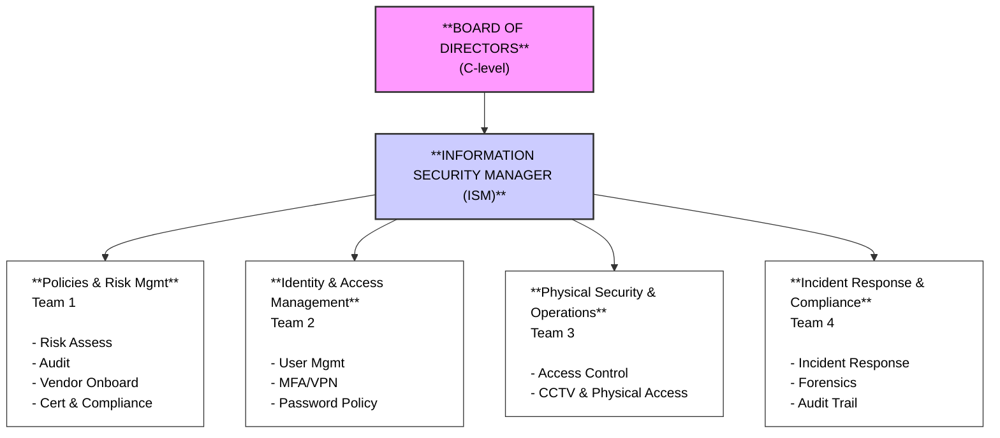
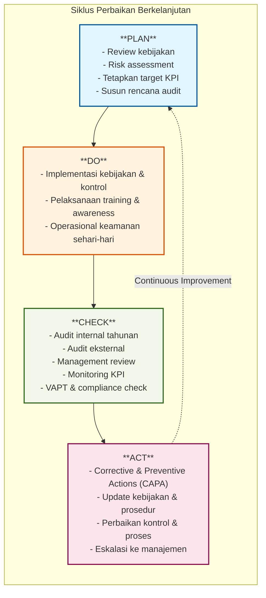
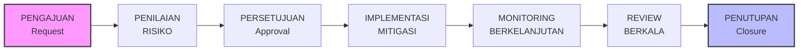
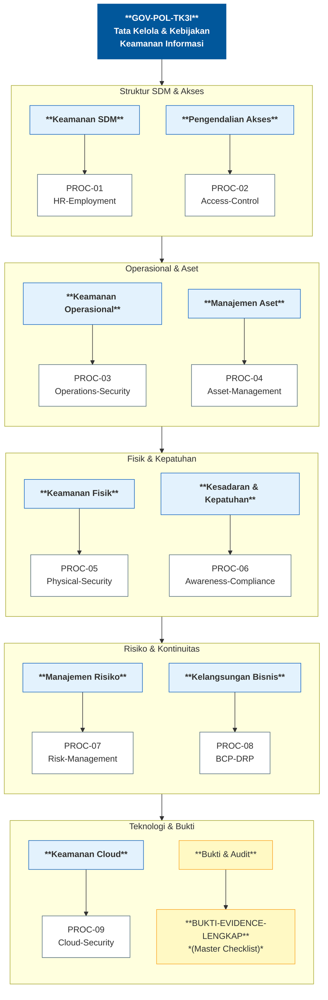

# TATA KELOLA DAN KEBIJAKAN KEAMANAN INFORMASI
## PT ECOMINDO SARANA CIPTA

## Cover
**Dokumen:** TATA KELOLA DAN KEBIJAKAN KEAMANAN INFORMASI  
**Versi:** 1.0  
**Tanggal Berlaku:** 15 April 2026  
**Status:** Final  
**Tingkat Keamanan:** Confidential

## Lembar Pengesahan

| Jabatan | Nama | Tanda Tangan | Tanggal |
|---------|------|-------------|--------|
| Direktur Utama / CEO | Ahmad Firdaus |   |   |
| Direktur Operasional / COO | Dodi Darundriyo |   |   |
| Manajer Keamanan Informasi (ISM)| Heri Fauzan |   |   |

## Daftar Isi

1. [Pendahuluan](#pendahuluan)
2. [Visi dan Misi](#visi-dan-misi)
3. [Tujuan Tata Kelola dan Kebijakan Keamanan Informasi](#tujuan-tk3i)
4. [Ruang Lingkup](#ruang-lingkup)
5. [Struktur Organisasi Keamanan Informasi](#struktur-organisasi)
6. [Peran dan Tanggung Jawab](#peran-dan-tanggung-jawab)
7. [Kebijakan Keamanan Informasi](#kebijakan-keamanan-informasi)
   - [Area 1: Manajemen Risiko Keamanan Informasi](#area-1)
   - [Area 2: Kebijakan Keamanan Informasi Umum & Security Baseline](#area-2)
   - [Area 3: Organisasi & Kesadaran Keamanan Informasi](#area-3)
   - [Area 4: Keamanan Sumber Daya Manusia](#area-4)
   - [Area 5: Manajemen Aset & Pengamanan Data](#area-5)
   - [Area 6: Pengendalian Akses & Identitas](#area-6)
   - [Area 7: Keamanan Fisik & Lingkungan](#area-7)
   - [Area 8: Keamanan Operasional](#area-8)
   - [Area 9: Keamanan Pengembangan Sistem](#area-9)
   - [Area 10: Kontinuitas Bisnis & Pemulihan Bencana](#area-10)
8. [Prosedur Operasional](#prosedur-operasional)
9. [Bukti dan Evidence](#bukti-dan-evidence)
10. [Proses Peninjauan dan Pembaruan](#proses-review-update)
11. [Kepatuhan, Audit, dan Evaluasi Rutin](#compliance-audit)
12. [Mekanisme Pengecualian (Exception Management)](#mekanisme-pengecualian)
13. [Kontak Darurat](#emergency-contacts)
14. [Referensi Dokumen & Peta Integrasi](#document-references-integration-map)
15. [Persetujuan & Distribusi](#approval-distribution)
16. [Tanggal Efektif & Amendemen](#effective-date-amendments)


## 1. PENDAHULUAN {#pendahuluan}

### 1.1 Latar Belakang

PT ECOMINDO SARANA CIPTA (Ecomindo) adalah perusahaan yang menyediakan layanan teknologi informasi dan jasa terkait. Dalam era digital ini, keamanan informasi menjadi aset strategis yang kritis untuk memastikan keberlanjutan bisnis, kepercayaan pelanggan, dan kepatuhan terhadap regulasi.

Dokumen Tata Kelola dan Kebijakan Keamanan Informasi ini dirancang untuk:

- Menetapkan kerangka kerja yang komprehensif bagi pengelolaan keamanan informasi di seluruh organisasi
- Memastikan perlindungan aset informasi dari berbagai ancaman dan risiko yang teridentifikasi
- Memenuhi standar internasional dan praktik terbaik (ISO 27001, CIS, NIST)
- Memenuhi persyaratan kepatuhan dari regulator, klien, dan pemangku kepentingan lainnya
- Mengkomunikasikan komitmen manajemen puncak terhadap keamanan informasi

### 1.2 Definisi Istilah Penting

| Istilah | Definisi |
|--------|----------|
| **Aset Informasi** | Data, sistem, aplikasi, infrastruktur yang bernilai bisnis dan memerlukan perlindungan |
| **Keamanan Informasi** | Perlindungan informasi dari akses, perubahan, atau penghapusan yang tidak sah |
| **Risiko** | Kombinasi antara probabilitas dan dampak dari suatu ancaman terhadap aset |
| **Kontrol Keamanan** | Mekanisme atau prosedur untuk meminimalkan risiko keamanan informasi |
| **Compliance** | Kepatuhan terhadap kebijakan, prosedur, standar, dan regulasi yang berlaku |
| **Insiden Keamanan** | Kejadian yang mengindikasikan atau mengakibatkan gangguan pada keamanan informasi |


## 2. VISI DAN MISI {#visi-dan-misi}

### 2.1 Visi Keamanan Informasi

> Menjadi organisasi yang memimpin dalam pengelolaan keamanan informasi dengan mengintegrasikan teknologi, proses, dan budaya keamanan untuk melindungi aset berharga dan kepercayaan stakeholder.

### 2.2 Misi Keamanan Informasi

1. **Perlindungan**: Melindungi semua aset informasi PT Ecomindo dari ancaman internal maupun eksternal
2. **Kesadaran**: Meningkatkan kesadaran dan komitmen seluruh karyawan terhadap keamanan informasi
3. **Kepatuhan**: Memastikan kepatuhan terhadap regulasi, standar industri, dan persyaratan klien
4. **Inovasi**: Terus meningkatkan efektivitas kontrol keamanan melalui pemanfaatan teknologi dan proses terkini
5. **Respons Cepat**: Mendeteksi dan merespons insiden keamanan secara cepat dan efektif


## 3. TUJUAN TATA KELOLA DAN KEBIJAKAN KEAMANAN INFORMASI {#tujuan-tk3i}

Tujuan TK3I PT Ecomindo adalah sebagai berikut:

1. **Perlindungan Aset**: Melindungi kerahasiaan, integritas, dan ketersediaan informasi organisasi dari ancaman internal maupun eksternal
2. **Manajemen Risiko**: Mengidentifikasi, menganalisis, dan mengelola risiko keamanan informasi secara sistematis dan terukur
3. **Kepatuhan**: Memenuhi persyaratan hukum, regulasi, dan standar industri yang berlaku di Indonesia maupun internasional
4. **Kontinuitas Bisnis**: Memastikan kelangsungan layanan bisnis melalui perencanaan Disaster Recovery dan Business Continuity
5. **Reputasi dan Kepercayaan**: Menjaga reputasi organisasi serta mempertahankan kepercayaan pemangku kepentingan
6. **Efisiensi Operasional**: Mengoptimalkan proses keamanan informasi guna mencapai efisiensi biaya dan operasional


## 4. RUANG LINGKUP {#ruang-lingkup}

### 4.1 Cakupan Organisasi

Pedoman TK3I ini berlaku untuk:

- Semua unit organisasi dan departemen di PT Ecomindo
- Semua karyawan, kontraktor, dan pihak ketiga yang bekerja atas nama organisasi
- Semua sistem informasi, aplikasi, dan infrastruktur IT yang digunakan organisasi
- Semua data dan aset informasi milik organisasi atau klien

### 4.2 10 Area Keamanan Informasi

Pedoman ini mencakup 10 area utama sesuai standar keamanan informasi internasional:

| Area | Topik | Referensi Dokumen |
|------|-------|-------------------|
| **1** | Manajemen Risiko | ISO 27001 Annex A.8 (Information security risk assessment) |
| **2** | Kebijakan Keamanan Informasi | ISO 27001 Annex A.5 (Information security policies) |
| **3** | Organisasi Keamanan Informasi | ISO 27001 Annex A.6 (Organization of information security) |
| **4** | Keamanan Sumber Daya Manusia | ISO 27001 Annex A.7 (Human resource security) |
| **5** | Manajemen Aset | ISO 27001 Annex A.8 (Asset management) |
| **6** | Pengendalian Akses | ISO 27001 Annex A.9 (Access control) |
| **7** | Keamanan Fisik & Lingkungan | ISO 27001 Annex A.11 (Physical and environmental security) |
| **8** | Keamanan Operasional | ISO 27001 Annex A.12 (Operations security) |
| **9** | Pengembangan Sistem Aman | ISO 27001 Annex A.14 (System acquisition, development and maintenance) |
| **10** | Kontinuitas Bisnis & Pemulihan Bencana | ISO 27001 Annex A.17 (Information security aspects of business continuity management) |


## 5. STRUKTUR ORGANISASI KEAMANAN INFORMASI {#struktur-organisasi}

### 5.1 Governance Model (ISO 27001 Aligned)



### 5.2 Struktur Pelaporan

**ISM melapor kepada:**

- CEO atau COO dalam hal strategi dan kepatuhan keamanan informasi
- Board/Audit Committee melalui laporan postur keamanan setiap kuartal

**ISM mengawasi:**

- 4 Tim Keamanan (Policies, Identity, Physical, Incident Response)
- Berkolaborasi dengan Departemen IT, HR, Finance, dan departemen lainnya


## 6. PERAN DAN TANGGUNG JAWAB {#peran-dan-tanggung-jawab}

### 6.1 Board of Directors

**Peran:**

- Mengawasi tata kelola keamanan informasi secara menyeluruh
- Memberikan persetujuan terhadap inisiatif strategis keamanan informasi
- Bertindak sebagai Executive Sponsor untuk TK3I dan inisiatif kepatuhan
- Otoritas tertinggi untuk persetujuan kebijakan keamanan

**Tanggung Jawab:**

- Memastikan TK3I selaras dengan strategi bisnis organisasi
- Meninjau laporan keamanan kuartalan dari Manajer Keamanan Informasi (ISM)
- Menyetujui strategi toleransi risiko dan mitigasi risiko
- Memastikan ketersediaan alokasi sumber daya yang memadai untuk keamanan informasi
- Menunjukkan komitmen nyata terhadap keamanan informasi kepada seluruh organisasi
- Menyetujui kebijakan dan prosedur utama yang berkaitan dengan keamanan informasi
- Mendukung alokasi anggaran untuk program keamanan
- Memastikan terselenggaranya program kesadaran keamanan di seluruh organisasi
- Memberikan persetujuan atas keputusan risiko tingkat tinggi


### 6.2 Manajer Keamanan Informasi (ISM)

**Peran:**

- Pemilik TK3I dan program keamanan informasi
- Penghubung utama antara IT, bisnis, dan kepatuhan

**Tanggung Jawab:**

- Mengembangkan, mengimplementasikan, dan memelihara TK3I
- Mendefinisikan kebijakan keamanan, standar, dan prosedur
- Mengelola tim keamanan informasi
- Melakukan penilaian risiko dan pengelolaan kerentanan
- Mengawasi semua 10 domain keamanan
- Melaporkan metrik keamanan kepada manajemen setiap bulan
- Mengelola kepatuhan terhadap regulasi dan persyaratan pemangku kepentingan
- Memimpin perencanaan respons insiden dan latihan
- Melakukan pelatihan kesadaran keamanan secara teratur
- Mengkoordinasikan dengan auditor eksternal dan penilai
- Mengelola alokasi anggaran keamanan

### 6.3 Information Security Teams

#### **Team 1: Policy & Risk Management**

- Mengembangkan kebijakan dan prosedur keamanan
- Melakukan penilaian risiko
- Mengelola penilaian keamanan vendor
- Pengelolaan audit dan kepatuhan

#### **Team 2: Identity & Access Management**

- Penyediaan dan penghapusan akun pengguna
- Implementasi kebijakan kata sandi dan MFA
- Pengelolaan akses jarak jauh dan VPN
- Tinjauan dan audit akses

#### **Team 3: Physical Security & Operations**

- Implementasi kontrol akses fisik
- Keamanan CCTV dan pusat data
- Konfigurasi dan pengerasan keamanan
- Firewall dan keamanan jaringan
- Pengelolaan perubahan
- Penilaian kerentanan dan patching

#### **Team 4: Incident Response & Compliance**

- Deteksi dan respons insiden
- Forensik digital dan pengumpulan bukti
- Perencanaan pemulihan bencana dan kontinuitas bisnis
- Pengelolaan jejak audit
- Pemantauan kepatuhan

### 6.4 IT Department

**Peran:**

- Mitra dalam implementasi kontrol keamanan

**Tanggung Jawab:**

- Mengimplementasikan konfigurasi keamanan sesuai kebijakan
- Memelihara keamanan sistem dan infrastruktur
- Menyebarkan alat dan solusi pemantauan keamanan
- Mendukung aktivitas respons insiden
- Melaporkan insiden keamanan kepada ISM (Information Security Manager)

### 6.5 Seluruh Karyawan

**Peran:**

- Garis pertahanan pertama untuk keamanan informasi

**Tanggung Jawab:**

- Mematuhi semua kebijakan dan prosedur
- Menyelesaikan pelatihan kesadaran keamanan wajib setiap tahun
- Melaporkan insiden keamanan atau aktivitas mencurigakan segera
- Melindungi kerahasiaan informasi sensitif
- Menggunakan VPN untuk akses jarak jauh
- Jangan berbagi kata sandi atau kredensial
- Kunci komputer saat meninggalkan meja
- Buang dokumen sensitif dengan benar
- Laporkan semua masalah keamanan kepada ISM atau IT

### 6.6 HR Department

**Peran:**

- Mitra dalam keamanan siklus hidup karyawan

**Tanggung Jawab:**

- Melakukan pemeriksaan latar belakang selama rekrutmen
- Memastikan tanda tangan NDA sebelum pekerjaan
- Menginformasikan ISM tentang pemutusan karyawan
- Memfasilitasi proses pencabutan akses
- Memelihara dokumentasi keamanan personel

### 6.7 Manajemen (Seluruh Tingkatan)

**Peran:**

- Mendukung implementasi inisiatif keamanan informasi di departemen masing-masing

**Tanggung Jawab:**

- Menegakkan kepatuhan seluruh anggota tim terhadap kebijakan keamanan informasi
- Memastikan seluruh anggota tim menyelesaikan pelatihan keamanan yang diwajibkan
- Melaporkan insiden keamanan dan permasalahan terkait secara segera
- Menyetujui alokasi anggaran untuk keamanan di lingkup departemen
- Mendorong budaya kesadaran keamanan di antara anggota tim


## 7. KEBIJAKAN KEAMANAN INFORMASI {#kebijakan-keamanan-informasi}

Dokumen ini adalah konsolidasi dari 10 kebijakan keamanan informasi utama yang mengacu pada standar keamanan informasi internasional dengan praktik terbaik.


## AREA 1: MANAJEMEN RISIKO KEAMANAN INFORMASI {#area-1}

### 1.1 Tujuan Kebijakan

Kebijakan ini bertujuan untuk memastikan bahwa PT Ecomindo menerapkan pengelolaan risiko keamanan informasi yang komprehensif, termasuk sertifikasi keamanan internasional, audit oleh pihak independen, dan penerapan security requirements berdasarkan standar best practices.

### 1.2 Ruang Lingkup

Kebijakan ini berlaku untuk:

- Seluruh organisasi PT Ecomindo
- Semua sistem informasi dan aset
- Semua ancaman dan risiko keamanan yang diidentifikasi

### 1.3 Kebijakan Utama

PT Ecomindo wajib mengelola risiko keamanan informasi secara komprehensif dengan sertifikasi, audit, dan/atau penerapan standar best practices.

#### **1.3.1 Sertifikasi Keamanan Informasi**

PT Ecomindo wajib merencanakan dan mengejar sertifikasi keamanan informasi dari badan independen atau minimal melaksanakan best practice keamanan informasi.

**Kebijakan Implementasi:**

- Security requirements berbasis best practices diterapkan sesuai ISO 27001, NIST, dan CIS
- PT Ecomindo harus mengidentifikasi cakupan sertifikasi dan menetapkan road map
- Dokumentasi penerapan best practices harus diverifikasi oleh auditor internal/eksternal

#### **1.3.2 Audit Keamanan Internal & Eksternal**

PT Ecomindo wajib melaksanakan audit keamanan internal dan eksternal secara teratur.

**Kebijakan Audit:**

- Audit internal dijadwalkan secara berkala
- Audit eksternal dilakukan oleh pihak independen
- Setiap aktivitas audit menghasilkan ringkasan eksekutif dan dokumentasi lengkap

#### **1.3.3 Penerapan Security Requirements Berdasarkan Best Practices**

PT Ecomindo menerapkan security requirements komprehensif mengacu pada standar best practices.

**Standar yang Diikuti:**

- ISO/IEC 27001 - Information Security Management
- NIST Cybersecurity Framework - Core functions: Identify, Protect, Detect, Respond, Recover
- CIS Critical Security Controls - Top 18-20 security controls
- OWASP Top 10 - Untuk application security

**Kebijakan Implementasi:**

- OS Hardening (Windows, Linux) dilakukan sesuai CIS Benchmark
- Database Hardening dilakukan sesuai standar vendor
- Network Hardening mencakup firewall, WAF, dan segmentasi
- Application Security meliputi secure coding, SAST/DAST
- Encryption Standards meliputi TLS 1.2+ dan AES-256 untuk data at rest
- Identity & Access menerapkan RBAC, MFA, dan password policy
- Monitoring & Logging menggunakan SIEM dan centralized logging
- Incident Response didokumentasikan secara formal
- Business Continuity mencakup DRP dan BCP

**Kebijakan Verifikasi:**

- Setiap hardening requirement didukung bukti seperti screenshot dan konfigurasi
- Dokumentasi security baseline untuk OS, DB, dan aplikasi dipelihara dengan baik
- Review dan pembaruan terhadap best practices dilakukan secara berkala

### 1.4 Tanggung Jawab

- **ISM (Manajer Keamanan Informasi)**: Memastikan sertifikasi, audit, dan pemeliharaan kepatuhan
- **Risk Management Team**: Melakukan penilaian risiko, memelihara jadwal audit
- **IT Department**: Menerapkan persyaratan keamanan, memelihara dokumentasi
- **Management**: Menyetujui ruang lingkup audit, meninjau temuan audit, menyetujui anggaran remediasi

### 1.5 Frekuensi & Peninjauan

- Peninjauan kebijakan: Dilakukan setiap tahun atau ketika terjadi perubahan persyaratan
- Audit internal: Minimal satu kali per tahun
- Audit eksternal: Dilakukan jika diperlukan berdasarkan kebutuhan sertifikasi, regulasi, atau permintaan klien


## AREA 2: KEBIJAKAN KEAMANAN INFORMASI UMUM & SECURITY BASELINE {#area-2}

### 2.1 Tujuan Kebijakan

Kebijakan ini menetapkan kerangka kerja komprehensif untuk keamanan informasi di PT Ecomindo, mencakup kebijakan umum dan security baseline technical untuk semua sistem dan aplikasi.

### 2.2 Ruang Lingkup

Kebijakan ini berlaku untuk:

- Semua karyawan, kontraktor, dan pihak ketiga
- Semua sistem informasi, aplikasi, perangkat, dan jaringan
- Semua data dan informasi sensitif

### 2.3 Kebijakan Utama

#### **2.3.1 Kebijakan Keamanan Informasi Umum**

PT Ecomindo menetapkan kebijakan formal keamanan informasi yang direview dan disosialisasikan secara menyeluruh.

**Isi Kebijakan Minimum:**

1. **Perlindungan Data Sensitif** - Klasifikasi data, enkripsi, backup
2. **Mekanisme Exception** - Proses exception/override dari kebijakan dengan persetujuan
3. **Access Controls** - Authentication, authorization, audit trails
4. **Incident Management** - Detection, response, forensics
5. **Policy Review Cycle** - Minimum 1 kali per tahun

**Kebijakan Formalisasi:**

- Kebijakan harus disahkan secara formal oleh CEO/Board
- Dokumen harus memiliki cover page/lembar pengesahan
- Dokumen harus memiliki daftar isi
- Dokumentasi harus lengkap dan terstruktur
- Dokumen harus didistribusikan ke seluruh organisasi
- Kebijakan harus disosialisasikan melalui pelatihan formal
- Kepatuhan terhadap kebijakan harus dipantau secara menyeluruh

**Kebijakan Sosialisasi:**

- Pelatihan untuk seluruh karyawan wajib dilaksanakan
- Pelatihan dilaksanakan minimum 1 kali per tahun
- Dokumentasi kehadiran dan rekaman pelatihan harus lengkap
- Evaluasi pemahaman setelah pelatihan harus dilakukan
- Formulir pengakuan ditandatangani oleh setiap karyawan

#### **2.3.2 Kebijakan Security Baseline Aplikasi, Sistem, dan Endpoint**

PT Ecomindo memiliki kebijakan security baseline yang disahkan formal dan direview secara berkala.

**Scope Security Baseline:**

- Operating Systems (Windows, Linux) - hardening, patching, antivirus
- Databases - access control, encryption, audit trails
- Applications - secure coding, SAST/DAST, penetration testing
- Endpoints/Workstations - password policy, antivirus, USB restrictions, screen lock
- Servers - minimal services, firewall rules, logging
- Network Components - firewall, WAF, IDS/IPS, segmentation

**Komponen Security Baseline:**

1. **Hardening Checklist** - Item-item yang harus dilakukan
2. **Security Requirements** - Standar teknis yang harus dipenuhi
3. **Security Checklist** - Pre-deployment verification checklist
4. **Configuration Standards** - Template configuration untuk setiap sistem type

**Exception Management:**

- Proses formal untuk permintaan exception dari security baseline
- Persetujuan harus diperoleh dari ISM dan manajer terkait
- Penilaian risiko harus dilakukan untuk setiap exception
- Exception bersifat terbatas waktu (misalnya 30-90 hari dengan review)
- Dokumentasi exception dan justifikasi harus lengkap

**Kebijakan Formalisasi & Sosialisasi:**

- Kebijakan baseline harus disahkan formal oleh CEO
- Dokumen harus memiliki cover page dan daftar isi
- Kebijakan baseline harus disosialisasikan ke tim IT, developer, dan administrator sistem
- Pelatihan harus disediakan dalam format tatap muka, e-learning, dan lokakarya
- Pelatihan harus dijalankan secara berkala minimum setahun sekali
- Materi sosialisasi harus disimpan sebagai dokumentasi

### 2.4 Tanggung Jawab

- **ISM (Manajer Keamanan Informasi)**: Merancang dan memelihara kebijakan, menyetujui pengecualian
- **IT Department**: Menerapkan baseline, memelihara dokumentasi
- **HR**: Memfasilitasi pelaksanaan pelatihan
- **All Employees**: Mematuhi kebijakan, menghadiri pelatihan

### 2.5 Frekuensi & Peninjauan

- Peninjauan kebijakan: Dilakukan setiap tahun atau ketika terjadi perubahan kebutuhan
- Pelatihan: Minimal satu kali per tahun untuk seluruh karyawan
- Peninjauan dan perpanjangan pengecualian: Minimal setiap kuartal


## AREA 3: ORGANISASI & KESADARAN KEAMANAN INFORMASI {#area-3}

### 3.1 Tujuan Kebijakan

Kebijakan ini memastikan bahwa PT Ecomindo memiliki struktur organisasi yang jelas untuk keamanan informasi dengan tim dedicated dan program awareness yang efektif untuk semua karyawan.

### 3.2 Ruang Lingkup

Kebijakan ini meliputi:

- Organisasi dan struktur tim keamanan informasi
- Job descriptions untuk posisi keamanan
- Security awareness program dan training

### 3.3 Requirement

#### **3.3.1 Struktur Organisasi Keamanan Informasi**

PT Ecomindo memiliki tim keamanan informasi yang khusus (bukan digabung dengan fungsi lain):

**Minimal Struktur yang Diperlukan:**

1. **ISM (Information Security Manager)** - Melapor kepada CEO/Direktur
2. **Security Policy & Compliance Officer** - Mengelola kebijakan, audit, kepatuhan
3. **Identity & Access Management Officer** - Mengelola akses pengguna, autentikasi
4. **Operations Security Officer** - Mengelola jaringan, operasi, respons insiden
5. **Physical & Environmental Security Officer** - Mengelola akses fisik, pusat data

**Posisi dapat dijabat oleh 1 orang (organisasi kecil) atau beberapa orang (organisasi besar) - tapi HARUS ada dedikasi yang jelas.**

**Dokumentasi Wajib:**

- Bagan Organisasi yang menunjukkan struktur keamanan informasi
- Jalur pelaporan yang jelas dengan CEO
- Dokumentasi formal bahwa ini adalah posisi khusus

#### **3.3.2 Job Description untuk Posisi Keamanan Informasi**

Setiap posisi di tim security HARUS memiliki Deskripsi Jabatan formal:

**Minimal Content per JD:**

1. **Judul Jabatan** - Contoh: Information Security Manager
2. **Melapor Kepada** - Siapa supervisor/manager
3. **Tanggung Jawab Utama** - Minimum 5-10 tanggung jawab spesifik keamanan informasi
4. **Persyaratan** - Pendidikan, pengalaman, keterampilan yang diperlukan
5. **Tanggung Jawab Keamanan Khusus** - Apa keamanan informasi yang dikelola
6. **Tingkat Otoritas & Persetujuan** - Apa yang dapat disetujui/diputuskan

**Contoh JD Items:**

- "Mengembangkan dan memelihara kebijakan keamanan informasi yang selaras dengan ISO 27001"
- "Melakukan penilaian risiko dan mengelola risiko keamanan informasi"
- "Memimpin aktivitas respons insiden dan mengelola forensik digital"
- "Mengelola anggaran keamanan dan menyetujui investasi keamanan"
- "Melaporkan kepada CEO tentang postur keamanan setiap triwulan"
- "Memastikan kepatuhan dengan standar keamanan informasi internasional"

**Storage & Distribution:**

- Deskripsi Jabatan didokumentasikan secara formal
- Salinan disimpan di sistem HR
- Disebarkan ke tim yang bersangkutan

#### **3.3.3 Program Kesadaran Keamanan**

PT Ecomindo menetapkan program kesadaran keamanan yang dijalankan melalui komunikasi dua arah dan pelatihan berkala.

**Program Scope:**

- Target: SEMUA karyawan, kontraktor, dan pihak ketiga
- Format: Komunikasi dua arah (tatap muka, e-learning, pelatihan online, lokakarya)
- Frekuensi: Pelatihan wajib dilaksanakan minimum 1 kali per tahun

**Kebijakan Pelatihan Tahunan:**

- Durasi minimum 1-2 jam per tahun per karyawan
- Konten mencakup 10 area keamanan informasi yang relevan dengan peran
- Peserta meliputi seluruh karyawan dan kontraktor
- Rekaman kehadiran dan sertifikat penyelesaian harus disimpan

**Kebijakan Aktivitas Awareness Berkelanjutan:**

- Buletin bulanan atau komunikasi rutin tentang topik keamanan dijalankan
- Lokakarya/seminar triwulanan diselenggarakan secara langsung atau online
- Peringatan email tentang ancaman terbaru dan insiden dikirim secara berkala
- Tips keamanan di tempat kerja disediakan secara rutin
- Latihan simulasi phishing dilaksanakan secara terjadwal

### 3.4 Tanggung Jawab

- **ISM (Information Security Manager)**: Memimpin program awareness, mengembangkan konten
- **HR**: Mendukung pelaksanaan pelatihan, memelihara rekaman
- **All Managers**: Memastikan tim menghadiri pelatihan
- **All Employees**: Menghadiri pelatihan wajib, menerapkan praktik keamanan

### 3.5 Frekuensi & Peninjauan

- Tinjauan struktur tim: Dilakukan setiap tahun
- Deskripsi jabatan: Diperbarui setiap kali terjadi perubahan peran atau tanggung jawab
- Pelatihan awareness: Wajib dilaksanakan minimal 1 kali per tahun untuk seluruh karyawan
- Aktivitas berkelanjutan: Dilaksanakan secara reguler sepanjang tahun


## AREA 4: KEAMANAN SUMBER DAYA MANUSIA {#area-4}

### 4.1 Tujuan Kebijakan

Kebijakan ini memastikan bahwa PT Ecomindo menerapkan kontrol keamanan sepanjang siklus hidup kepegawaian, termasuk rekrutmen, NDA, dan terminasi, untuk semua karyawan dan kontraktor.

### 4.2 Ruang Lingkup

Kebijakan ini mencakup:

- Proses rekrutmen dan pemeriksaan latar belakang
- NDA dan perjanjian keamanan
- Terminasi dan pencabutan akses
- Pengelolaan kontraktor dan sub-kontraktor

### 4.3 Requirement 

#### **4.3.1 Employee Lifecycle Management**

PT Ecomindo memiliki mekanisme pengelolaan kepegawaian yang komprehensif:

**A. Recruitment & Background Check**

- Background check WAJIB dilakukan untuk SEMUA calon karyawan sebelum hiring
- Background check minimal mencakup:
  - Verification identitas (KTP, SIM)
  - Verification riwayat pekerjaan (reference checks dari employer sebelumnya)
  - Criminal record check
  - Credit check (untuk posisi finansial/sensitive)
  - Social media screening (untuk red flags)

- Hasil background check dikompilasi dalam formal report
- Hanya kandidat yang pass dapat di-hire
- Records disimpan di HR file

**B. Termination & Exit Clearance**

- Mekanisme formal untuk employee termination
- Exit clearance process WAJIB dilakukan sebelum employee benar-benar keluar:
  - Revoke semua system access (email, VPN, database, aplikasi)
  - Revoke physical access (badge, parking)
  - Collect semua equipment (laptop, phone, badges, keys)
  - Conduct exit interview untuk gather information
  - Document final status untuk employee file

- Timeline: Access HARUS direvoke dalam 24 jam sejak termination date
- Documentation: Exit clearance form signed dan disimpan

**C. Contractors & Sub-contractors**

- Semua contractors (temporary, full-time, part-time) harus mengikuti mekanisme yang sama dengan karyawan:
  - Background check sama seperti employees
  - Pernyataan yang jelas dalam kontrak tentang security obligations
  - NDA mengikat kontraktor harus ditandatangani sebelum mulai bekerja
  - Termination process mengikuti prosedur formal yang setara dengan karyawan
  - Clear end date dan termination procedures harus didokumentasikan

**Kebijakan Pengawasan Sub-kontraktor:**

- Background check wajib dilakukan untuk semua sub-kontraktor
- Mekanisme pemutusan hubungan kerja untuk sub-kontraktor harus terdokumentasi secara formal
- Penggunaan sub-kontraktor dalam lingkup MMI harus memperoleh persetujuan formal dari MMI

#### **4.3.2 NDA (Non-Disclosure Agreement) & Security Agreement**

PT Ecomindo memiliki kebijakan NDA formal:

**Personnel NDA Requirements:**

- WAJIB ditandatangani oleh SEMUA karyawan sebelum atau pada hari pertama
- WAJIB ditandatangani oleh SEMUA kontraktor sebelum mulai bekerja
- NDA harus mencakup kerahasiaan data sensitif perusahaan dengan:
  - Klausa tentang kerahasiaan data perusahaan
  - Klausa tentang dilarang membagikan data ke pihak lain
  - Klausa terminasi ketika karyawan/kontraktor keluar

- Format NDA: Dokumen hukum profesional sesuai standar perusahaan
- Distribusi: Salinan untuk karyawan, salinan untuk file HR
- Dokumentasi:
  - Daftar utama semua NDA yang ditandatangani
  - Cadangan/scan digital dari dokumen yang ditandatangani
  - Diindeks berdasarkan nama karyawan, posisi, tanggal penugasan

**Security Agreements:**

- Terpisah atau digabungkan dengan NDA, pernyataan jelas tentang:
  - Kewajiban keamanan (mematuhi kebijakan)
  - Persyaratan kerahasiaan
  - Tanggung jawab perlindungan kata sandi
  - Kewajiban pelaporan insiden
  - Konsekuensi untuk pelanggaran (hingga terminasi)

**For External Parties/Vendor:**

- Perjanjian kemitraan HARUS mencakup persyaratan keamanan
- NDA ditandatangani sebelum akses ke data/sistem
- Kontrak jelas tentang perlindungan data dan tanggung jawab

#### **4.3.3 Documentation & Records**

- Semua dokumentasi keamanan HR HARUS dipelihara dengan rekaman formal:
  - Kebijakan rekrutmen dan prosedur pemeriksaan latar belakang
  - Laporan pemeriksaan latar belakang yang ditandatangani untuk setiap karyawan
  - Semua NDA yang ditandatangani (terorganisir dan diindeks)
  - Daftar periksa terminasi dan formulir izin keluar
  - Daftar utama kontraktor dengan salinan kontrak
  - Rekaman pencabutan akses (timestamp, siapa yang melakukannya)

### 4.4 Tanggung Jawab

- **HR Department**: Memimpin rekrutmen, memelihara salinan NDA, mengkoordinasikan terminasi
- **ISM**: Persetujuan untuk kebijakan rekrutmen, audit kepatuhan NDA
- **IT/Admin**: Melaksanakan pencabutan akses di sistem
- **Managers**: Memberitahu HR tentang terminasi segera

### 4.5 Frekuensi & Peninjauan

- Pemeriksaan latar belakang: Dilakukan untuk setiap proses rekrutmen
- Pengelolaan NDA: Berjalan berkelanjutan dan dipantau setiap triwulan
- Proses terminasi: Dilaksanakan untuk setiap kasus terminasi
- Tinjauan kebijakan: Dilakukan setiap tahun


## AREA 5: MANAJEMEN ASET & PENGAMANAN DATA {#area-5}

### 5.1 Tujuan Kebijakan

Kebijakan ini mengatur perlindungan komprehensif untuk semua data dan aset informasi PT Ecomindo, mencakup klasifikasi, enkripsi, secure disposal, dan removable media protection.

### 5.2 Ruang Lingkup

Kebijakan ini berlaku untuk:

- Semua data (transisional, historical, backup)
- Semua perangkat (servers, workstations, removable media)
- Semua aset informasi milik organisasi atau klien

### 5.3 Requirement 

#### **5.3.1 Data Protection & Information Handling Policy**

PT Ecomindo menetapkan 4 komponen WAJIB dalam kebijakan pengamanan data:

**A. Data Classification**

- Semua data harus diklasifikasikan ke dalam salah satu level:
  1. **Public** - Data yang dapat dibagikan ke publik (marketing materials, public info)
  2. **Internal** - Data internal only (policies, non-sensitive memos)
  3. **Confidential** - Sensitive business data (financial, strategic plans)
  4. **Restricted** - Highest sensitivity (personal data, security credentials, data sensitif perusahaan)

- Setiap data harus memiliki label/tag dengan klasifikasi
- Pemilik yang berbeda untuk setiap level
- Pembatasan penanganan yang berbeda sesuai klasifikasi
- Kebijakan klasifikasi formal dan terdokumentasi

**B. Encryption Standards**

- **Data-at-Transit**: Semua data sensitif (Confidential/Restricted) harus dienkripsi saat transit melalui jaringan
  - Minimum: TLS 1.2 atau lebih baru
  - Untuk HTTPS: Paksa HTTPS, redirect HTTP ke HTTPS
  - For APIs: OAuth 2.0 atau JWT with HTTPS
  - For VPN: Gunakan enkripsi kuat (AES-256 atau equivalent)

- **Data-at-Rest**: Semua data sensitif yang disimpan di disk/database harus dienkripsi
  - Minimum: AES-256 encryption
  - For databases: Gunakan database-level encryption atau full-disk encryption
  - For files: Gunakan file-level encryption (BitLocker, FileVault, LUKS)
  - Key management: Encryption keys disimpan dengan aman, tidak hardcoded
  - Key rotation: Minimal tahunan
  - Documentation: Encryption audit trail, configuration documentation

**C. Secure Disposal of Devices**

- Prosedur formal untuk disposal/decommissioning devices:
  - Before disposal: Semua data harus dihapus secara aman menggunakan:
    - NIST SP 800-88 compliant tool (e.g., Eraser, DBAN)
    - Or vendor secure erase feature
    - Or physical destruction (shredding, incineration)
  - Verification: Certificate of destruction untuk setiap device
  - Log: Pelihara inventaris perangkat yang dibuang dengan tanggal

- Applicable untuk: Servers, workstations, laptops, USB drives, external drives, SSD, HDD

**D. Removable Media Protection**

- Controls untuk removable media (USB drives, external USB, SD cards):
  1. **Usage Policy**: 
     - Penggunaan removable media harus disetujui terlebih dahulu
     - Hanya perangkat yang disetujui dapat digunakan
     - Personal USB drives tidak diizinkan (kecuali pengecualian)
  2. **Encryption**: Semua removable media yang membawa data sensitif harus dienkripsi
  3. **Monitoring**: Gunakan kontrol teknis untuk mendeteksi/membatasi penggunaan USB:
     - Endpoint DLP (Data Loss Prevention) software
     - USB device whitelisting
     - Monitoring logs of USB connections
  4. **Disposal**: Proses pembuangan aman yang sama sebagai perangkat lainnya

#### **5.3.2 Cloud Data Security Policy (PaaS/SaaS/IaaS)**

Untuk organisasi yang menggunakan cloud services, kebijakan ini mencakup 6 components:

**A. Data Classification** - Sama seperti 5.3.1.A untuk cloud data

**B. Encryption**

- Data-at-transit dienkripsi (TLS 1.2+) ke/dari cloud provider
- Data-at-rest dienkripsi di cloud storage
- Encryption keys: Baik dikelola pelanggan atau dikelola penyedia cloud yang diverifikasi
- Backup encryption: Semua cloud backups harus dienkripsi

**C. Personal Data & PII Protection**

- Requirement: Identifikasi dan lindungi PII (names, emails, phone, addresses, SSN, etc.)
- Encryption: PII harus dienkripsi
- Masking: Untuk development/testing, PII harus ditutupi/dianonimkan
- Privacy: Patuhi regulasi privasi data (GDPR, PDPA, etc.)

**D. Backup & Restore**

- Cloud provider harus menyediakan:
  - Automated backup frequency (minimal harian)
  - Multiple geographic locations untuk redundancy
  - Clear RTO/RPO SLA dalam contract
  - Test restore capability secara teratur (minimal triwulanan)
  - Encryption untuk backups

**E. Secure Disposal**

- Kebijakan jelas untuk penghapusan data dari cloud:
  - When contract ends: Semua data harus dihapus atau dikembalikan
  - Timeline: Penghapusan dalam 30-90 hari (per contract)
  - Verification: Certificate of deletion
  - Residual data check: Pastikan tidak ada salinan yang tersisa di sistem penyedia cloud

**F. Secure Deletion from Cache**

- Cloud provider harus menghapus secara aman:
  - Cache data ketika objek dihapus
  - Temporary files setelah operasi
  - Logs retention sesuai kebijakan (tidak selamanya)
  - Documentation: Kebijakan retention jelas dalam kontrak

### 5.4 Tanggung Jawab

- **Data Owner**: Klasifikasikan data, setujui pembuangan
- **IT Department**: Terapkan enkripsi, jalankan pembuangan, pantau kepatuhan
- **ISM**: Setujui kebijakan penanganan data, audit kepatuhan

### 5.5 Frekuensi & Peninjauan

- Klasifikasi data: Berjalan berkelanjutan dengan peninjauan tahunan
- Audit enkripsi: Dilakukan setiap semester (dua kali per tahun)
- Verifikasi pembuangan: Dilakukan pada setiap proses pembuangan perangkat
- Peninjauan kebijakan: Dilakukan setiap tahun


## AREA 6: PENGENDALIAN AKSES & IDENTITAS {#area-6}

### 6.1 Tujuan Kebijakan

Kebijakan ini mengatur pengelolaan akses pengguna dan identitas untuk semua sistem PT Ecomindo dengan mekanisme berbasis least privilege principle.

### 6.2 Ruang Lingkup

Kebijakan ini berlaku untuk:

- Semua pengguna di sistem organisasi
- Semua sistem informasi dan cloud services
- Semua akses eksternal (remote, VPN, API)

### 6.3 Kebijakan Utama

#### **6.3.1 Identity & Access Management (IAM)**

PT Ecomindo menerapkan IAM berbasis least privilege dengan review berkala dan dokumentasi formal.

**Kebijakan User Account Lifecycle Management:**

- Pembuatan, modifikasi, dan penonaktifan akun pengguna dilakukan sesuai kebijakan formal
- Prinsip least privilege diterapkan pada semua akun
- Tinjauan akses dilakukan secara berkala
- Dokumentasi formal dari tinjauan akses harus lengkap

#### **6.3.2 Cloud Provider IAM**

Untuk cloud services (AWS, Azure, GCP), kebijakan IAM khusus diterapkan:

**A. User Management**

- Manajemen siklus hidup sama seperti on-premise (pembuatan, perubahan, penonaktifan)
- Spesifik cloud: Akun layanan untuk aplikasi, bukan pengguna manusia
- MFA WAJIB untuk semua human cloud accounts

**B. MFA for Administration**

- Semua akun admin/privileged harus menggunakan MFA:
  - MFA type: TOTP (Time-based One-Time Password) atau hardware token
  - Providers: Google Authenticator, Microsoft Authenticator, Yubikey, SMS (last resort - less secure)
  - Backup codes: Hasilkan dan simpan dengan aman untuk pemulihan akun
  - Enforcement: MFA diperlukan SEBELUM akses diberikan

**C. Separation of Duties**

- Akun admin harus dipisahkan berdasarkan organisasi/fungsi:
  - Contoh: Akun terpisah untuk AWS Billing vs AWS Security vs AWS Development
  - Benefit: Mencegah satu orang mengontrol segalanya
  - Implementation: ID akun berbeda untuk privilege berbeda
  - Documentation: Matriks jelas dari akun admin mana yang memiliki privilege apa

#### **6.3.3 Remote Access & VPN**

PT Ecomindo menetapkan kebijakan akses jarak jauh dengan keamanan kuat:

**A. VPN Requirement**

- Semua akses jarak jauh ke sistem perusahaan harus melalui VPN
- Exception: Hanya layanan yang menghadap publik (portal web, akses email melalui webmail)
- Current standard: Otentikasi berbasis sertifikat VPN PLUS nama pengguna/kata sandi PLUS MFA

**B. Two-Factor Authentication (2FA)**

- Wajib untuk semua akses jarak jauh, termasuk VPN:
  1. Something you know: Nama pengguna + Kata sandi (kebijakan kata sandi kuat berlaku)
  2. Something you have: Kode satu kali dari aplikasi autentikator ATAU token perangkat keras
- Providers: Google Authenticator, Microsoft Authenticator, Yubikey, SMS (last resort - less secure)
- Backup: Beberapa metode 2FA terdaftar untuk pemulihan akun

**C. Monitoring**

- Akses VPN harus dipantau dan dicatat:
  - Pencatatan log: ID pengguna, alamat IP, timestamp, durasi sesi, data yang ditransfer
  - Pencatatan terpusat: SIEM atau server pencatatan
  - Alerts: Peringatan jika pola akses tidak biasa (misalnya, di luar jam kerja, lokasi tidak biasa)
  - Review: Tinjauan bulanan dari log akses untuk anomali

**D. Certificate & Key Management**

- Sertifikat VPN harus:
  - Unik per pengguna
  - Enkripsi kuat (RSA 2048-bit minimum)
  - Diputar setiap tahun
  - Dicabut saat terminasi pengguna
  - Dicadangkan dengan aman

### 6.4 Tanggung Jawab

- **ISM**: Merancang kebijakan IAM, menyetujui permintaan akses, mengawasi kepatuhan
- **IAM/Security Team**: Melaksanakan siklus hidup pengguna, melakukan tinjauan akses
- **IT Department**: Mengimplementasikan di sistem, memelihara infrastruktur
- **All Managers**: Meminta akses, berpartisipasi dalam tinjauan akses

### 6.5 Frekuensi & Peninjauan

- Siklus hidup pengguna: Dilaksanakan segera sesuai kebutuhan
- Tinjauan akses: Minimal setiap triwulan ditambah tinjauan komprehensif tahunan
- Tinjauan kebijakan: Dilakukan setiap tahun
- Pemantauan VPN: Berjalan berkelanjutan dengan tinjauan bulanan


## AREA 7: KEAMANAN FISIK & LINGKUNGAN {#area-7}

### 7.1 Tujuan Kebijakan

Kebijakan ini mengatur keamanan fisik akses ke ruangan kerja dan datacenter untuk melindungi aset dan informasi dari ancaman fisik.

### 7.2 Ruang Lingkup

Kebijakan ini meliputi:

- Ruangan kerja (offices)
- Server room
- Tempat penyimpanan peralatan
- Semua fasilitas milik atau digunakan organisasi

### 7.3 Kebijakan Utama

#### **7.3.1 Secure Areas - Working Environment**

PT Ecomindo mengimplementasikan kontrol akses fisik untuk lingkungan kerja dan menetapkan persyaratan monitoring fisik.

**A. Access Card / Biometric**

- Sistem kontrol akses harus diterapkan dengan kartu akses atau biometrik
- Masuk ke area harus dicatat secara otomatis
- Izin harus dibedakan untuk setiap area kerja
- Tinjauan kartu akses dilakukan secara berkala

**B. CCTV Monitoring**

- CCTV harus dipasang di area kerja yang kritis
- Kamera harus merekam semua masuk/keluar dan menyimpan rekaman yang dapat diakses untuk investigasi
- Implementasi CCTV harus mencakup cakupan area yang memadai
- Retensi rekaman CCTV harus sesuai kebijakan keamanan fisik

**Kebijakan Pengawasan:**

- Kartu akses dan CCTV digunakan bersama-sama untuk kontrol akses fisik yang komprehensif
- Keabsahan akses diverifikasi dengan rekaman elektronik dan tinjauan berkala

### 7.4 Tanggung Jawab

- **Facilities Manager**: Pemeliharaan sistem kartu akses, penerapan CCTV
- **ISM**: Menyetujui tingkat akses, meninjau log

### 7.5 Frekuensi & Peninjauan

- Tinjauan kartu akses: Setiap triwulan
- Tinjauan CCTV: Berjalan berkelanjutan dengan ringkasan laporan bulanan
- Tinjauan kebijakan: Dilakukan setiap tahun


## AREA 8: KEAMANAN OPERASIONAL {#area-8}

### 8.1 Tujuan Kebijakan

Kebijakan ini mengatur keamanan operasional sistem dan infrastruktur IT, termasuk configuration hardening, change management, network security, incident response, dan vulnerability management.

### 8.2 Ruang Lingkup

Kebijakan ini berlaku untuk:

- Semua server, workstation, perangkat jaringan
- Semua environment produksi, staging, dan development
- Semua security monitoring dan incident management

### 8.3 Requirement 

#### **8.3.1 Security Configuration & Hardening**

PT Ecomindo menerapkan 3 komponen security configuration WAJIB:

**A. Password Management**

- Kebijakan kata sandi formal harus diterapkan untuk semua sistem:
  1. **Persyaratan minimum**:
     - Panjang minimum: 12 karakter (15+ direkomendasikan)
     - Kompleksitas: Campuran huruf besar, kecil, angka, simbol
     - Usia: Kedaluwarsa setiap 90 hari (memerlukan perubahan)
     - Riwayat: Tidak dapat menggunakan ulang 5 kata sandi terakhir
     - Penguncian: Setelah 3-5 upaya gagal, akun dikunci selama 30 menit

  2. **Manajemen kata sandi untuk akun layanan**:
     - Kata sandi akun layanan harus disimpan dengan aman (tidak hardcoded)
     - Gunakan: Vault/manajer kata sandi (HashiCorp Vault, CyberArk, dll.)
     - Rotasi: Kata sandi akun layanan dirotasi minimal triwulanan
     - Audit: Semua perubahan kata sandi dicatat

  3. **Akun Khusus/Administratif**:
     - Kata sandi admin/root/superuser: Harus unik per sistem
     - Penyimpanan: Disimpan dengan aman di vault kata sandi SAJA
     - Akses: Terbatas hanya untuk ISM & IT senior yang berwenang
     - Rotasi: Setiap 90 hari
     - Audit: Setiap akses dicatat dan ditinjau triwulanan

  4. **Multi-Factor Authentication (MFA)**:
     - MFA wajib untuk: Semua administrator, Semua akses jarak jauh, Semua akses cloud
     - MFA opsional untuk: Karyawan reguler (direkomendasikan)
     - Jenis: TOTP (Google Authenticator), token perangkat keras (lebih disukai)

**B. Hardening**

- Pengerasan sistem operasi wajib sesuai CIS Benchmarks:

  **Untuk Server Windows:**

  - Layanan minimal berjalan (nonaktifkan layanan yang tidak perlu)
  - Windows Firewall: Diaktifkan & dikonfigurasi dengan aturan spesifik
  - Windows Defender/antivirus: Diaktifkan & diperbarui
  - Manajemen patch: Patch keamanan bulanan diterapkan ke semua sistem
  - Gambar baseline: Buat & pelihara gambar OS baseline yang aman
  - Konfigurasi: Dokumentasikan semua konfigurasi & pengaturan OS
  - Audit: Audit konfigurasi reguler vs baseline

  **Untuk Server Linux:**

  - Prinsip yang sama seperti Windows
  - Gunakan AIDE/Tripwire untuk pemantauan integritas file
  - Pengerasan SSH: Otentikasi berbasis kunci SSH (tidak ada kata sandi), port non-standar
  - Sudoers: Akses sudo terbatas dengan opsi tanpa kata sandi dinonaktifkan
  - SELinux/AppArmor: Diaktifkan dengan kebijakan restriktif
  - Audit: auditd diaktifkan untuk semua pencatatan perintah

  **Untuk Perangkat Jaringan:**

  - Daftar kontrol akses (ACLs): Batasi lalu lintas ke hanya port/protokol yang diperlukan
  - Pencatatan: Semua perubahan konfigurasi dicatat
  - Akses manajemen: VPN/Host bastion diperlukan (tidak ada akses internet langsung)
  - Firmware: Diperbarui ke versi stabil terbaru
  - Kredensial: Diubah dari default, disimpan dengan aman

  **Untuk Database:**

  - Layanan minimal: Hanya listener yang diperlukan diaktifkan
  - Akun database: Kredensial unik, kata sandi kuat
  - Jaringan: Database tidak dapat diakses langsung dari internet (firewall, VPN diperlukan)
  - Audit: Diaktifkan untuk semua akses data (siapa, apa, kapan)
  - Backup: Backup otomatis reguler dengan enkripsi
  - Patch: Terapkan patch keamanan vendor bulanan

**C. Antivirus & Patch Management**

- Antivirus wajib diinstal & dipelihara:
  - Semua endpoint (workstation, server): Perlindungan endpoint antivirus/EDR
  - Diperbarui: Tanda tangan/definisi diperbarui minimal harian
  - Pemindaian: Pemindaian sistem penuh triwulanan, pemindaian cepat harian
  - Karantina: File terinfeksi diisolasi & dilaporkan
  - Pemantauan: Peringatan antivirus dipantau secara terpusat

- Manajemen patch wajib proses formal:
  1. **Inventaris**: Pelihara inventaris saat ini dari semua sistem/aplikasi IT
  2. **Sumber patch**: Berlangganan ke bulletin keamanan vendor (Microsoft, Adobe, dll.)
  3. **Pengujian**: Uji patch di environment non-produksi terlebih dahulu
  4. **Penerapan**: Penerapan terjadwal pada jendela pemeliharaan
  5. **Verifikasi**: Verifikasi patch diterapkan, fungsionalitas sistem diverifikasi
  6. **Pelaporan**: Laporan bulanan mengenai patch yang telah diterapkan
  7. **Timeline**: Patch kritis harus diterapkan dalam 30 hari, patch reguler secara triwulanan

#### **8.3.2 Change Management**

PT Ecomindo menetapkan proses manajemen perubahan formal untuk semua perubahan produksi:

**A. Kebijakan Perubahan Sistem Produksi**

- Kebijakan wajib formal dengan:
  - Persyaratan persetujuan tertulis SEBELUM perubahan
  - Formulir permintaan perubahan dengan detail
  - Penilaian dampak (risiko, rencana rollback)
  - Jendela pemeliharaan terjadwal
  - Hierarki persetujuan (manajer, ISM, COO)

**B. Change Request Process**

1. **Kirim**: Staf IT mengirim permintaan perubahan dengan:
   - Apa: Perubahan apa yang diusulkan
   - Mengapa: Justifikasi bisnis
   - Kapan: Tanggal waktu yang diusulkan (di luar jam kerja lebih disukai)
   - Risiko: Risiko potensial & mitigasi
   - Rollback: Jika gagal, prosedur rollback

2. **Tinjauan**: Dewan tinjauan perubahan (manajer IT, ISM, stakeholder) meninjau untuk:
   - Kebutuhan bisnis dibenarkan?
   - Risiko dapat diterima?
   - Sumber daya tersedia?
   - Pengujian dilakukan?

3. **Setujui**: Persetujuan dari manajer, direktur IT, ISM (otorisasi bertingkat)

4. **Implementasi**: Eksekusi selama jendela pemeliharaan terjadwal
   - Dengan: Setidaknya 2 staf IT hadir (satu mengeksekusi, satu memantau)
   - Komunikasi: Beritahu pengguna jika downtime diharapkan
   - Rollback siap: Jika gagal, siap untuk rollback

5. **Verifikasi**: Konfirmasi perubahan diterapkan dengan sukses
   - Fungsionalitas sistem: Semua sistem berfungsi?
   - Performa: Performa dapat diterima?
   - Log: Periksa log sistem untuk error

6. **Dokumentasi**: "Semua perubahan dicatat dengan":
   - Detail perubahan, tanggal, waktu, orang
   - Rantai persetujuan
   - Catatan implementasi
   - Hasil (sukses/gagal)
   - Pelajaran yang dipelajari

**C. Emergency Changes**

- Untuk patch keamanan mendesak atau outage kritis:
  - Persetujuan verbal dari ISM dapat diterima
  - Perubahan masih didokumentasikan (retroaktif jika diperlukan)
  - Permintaan perubahan formal dikirim dalam 24 jam

#### **8.3.3 Network Security & Segregation**

PT Ecomindo menetapkan 3 kontrol keamanan jaringan wajib:

**A. Segregation Environment Dev/Test/Production**

- Pemisahan jaringan wajib:
  - Jaringan terpisah (atau VLAN) untuk development, testing, production
  - Aturan firewall: Filtering ketat antara environment (prod tidak bisa mencapai dev langsung)
  - Tujuan: Mencegah perubahan tidak sengaja/tidak sah ke production dari developer

**B. Firewall & WAF (Web Application Firewall)**

- Arsitektur firewall:
  - Firewall perimeter: Antara internet dan jaringan internal
  - Aturan: Default-deny inbound, hanya port yang diperlukan terbuka
  - Konfigurasi: Didokumentasikan dalam matriks aturan firewall
  - Pencatatan: Semua koneksi inbound/outbound dicatat
  - Tinjauan: Tinjauan bulanan dari log firewall untuk pola mencurigakan

- WAF (jika berlaku untuk aplikasi web):
  - Diterapkan untuk semua aplikasi web yang menghadap internet
  - Aturan: Dikonfigurasi untuk memblokir serangan OWASP Top 10 (SQL injection, XSS, dll.)
  - Pencatatan: Upaya SQL injection, upaya XSS dicatat
  - Penyesuaian: Penyesuaian reguler untuk mengurangi false positive

**C. Network Monitoring & Logging**

- Pemantauan wajib dengan:
  - Alat pemantauan jaringan (IDS/IPS atau serupa)
  - Pencatatan terpusat: Log firewall, server, aplikasi dikirim ke SIEM
  - Peringatan: Peringatan otomatis untuk aktivitas mencurigakan (port scans, DDoS, dll.)
  - Tinjauan: Tinjauan mingguan dari data pemantauan, tinjauan formal bulanan
  - Retensi: Log dipertahankan minimal 90 hari, kritis 1 tahun

#### **8.3.4 VAPT (Vulnerability Assessment & Penetration Testing)**

PT Ecomindo melakukan penilaian kerentanan & penetration testing reguler:

**A. Vulnerability Assessment**

- Ruang lingkup: Semua sistem (server, aplikasi, perangkat jaringan)
- Frekuensi: Triwulanan (minimum)
- Metode: Pemindaian otomatis menggunakan alat:
  - Tenable Nessus, OpenVAS, Qualys, atau serupa
  - Mencakup: CVE yang diketahui, masalah konfigurasi, kata sandi lemah
- Hasil: Laporan dengan:
  - Kerentanan yang ditemukan dengan severity (Kritis, Tinggi, Sedang, Rendah)
  - Rekomendasi remediasi
  - Timeline untuk perbaikan

**B. Penetration Testing**

- Ruang lingkup: Perimeter jaringan, aplikasi, sistem internal
- Frekuensi: Tahunan (minimum), atau setelah perubahan besar
- Metode: Penyerang eksternal yang berwenang mencoba penetrasi
  - Dapat berupa: Black-box (tidak ada pengetahuan), Grey-box (pengetahuan terbatas), White-box (pengetahuan penuh)
- Hasil: Ringkasan eksekutif dengan:
  - Temuan kritis
  - Rekomendasi
  - Timeline remediasi

**C. Findings Remediation & Tracking**

- Temuan dari VAPT harus diremediasi:
  - Lacak: Gunakan sistem pelacakan masalah (Jira, dll.)
  - Timeline: Kritis dalam 30 hari, Tinggi dalam 60 hari, Sedang triwulanan
  - Verifikasi: Uji ulang sampai diverifikasi diperbaiki
  - Laporan: Pembaruan status bulanan ke manajemen
  - Dokumentasi: Semua upaya remediasi didokumentasikan

#### **8.3.5 Incident Management & Response**

PT Ecomindo memiliki program respons insiden formal:

**A. Detection & Response Process**

1. **Deteksi**:
   - Tim SOC memantau peringatan dari: Firewall, IDS/IPS, antivirus, SIEM
   - Peringatan dikelompokkan berdasarkan severity
   - Triaging peringatan: Tentukan jika true positive atau false positive

2. **Identifikasi**:
   - Analisis peringatan: Kumpulkan log, periksa sistem yang terpengaruh
   - Tentukan: Apakah ini insiden keamanan yang dikonfirmasi?
   - Pengumpulan informasi: Siapa/apa/kapan/di mana/bagaimana/mengapa

3. **Penahanan**:
   - Jangka pendek: Hentikan penyebaran insiden (isolasi sistem yang terpengaruh)
   - Jangka panjang: Remediasi penyebab mendasar
   - Komunikasi: Beritahu manajemen, tim terkait

4. **Pemberantasan**:
   - Hapus malware/penyerang: Bersihkan sistem yang terpengaruh
   - Patch kerentanan: Perbaiki masalah keamanan mendasar
   - Verifikasi: Pastikan insiden dieliminasi

5. **Pemulihan**:
   - Pulihkan layanan: Bawa sistem kembali online
   - Pemantauan: Pantau secara ketat untuk rekurensi
   - Timeline: Pulihkan dalam SLA RTO

6. **Pelajaran yang Dipelajari**:
   - Setelah insiden: Lakukan tinjauan pasca-insiden
   - Dokumentasi: Analisis akar penyebab, rekomendasi
   - Implementasi: Perbaikan proses untuk mencegah rekurensi

**B. Incident Documentation & Forensics**

- Semua insiden didokumentasikan dengan:
  - ID insiden, tanggal, waktu ditemukan
  - Metode deteksi (peringatan, laporan pengguna, dll.)
  - Deskripsi: Apa yang terjadi
  - Investigasi: Log dianalisis, temuan
  - Timeline: Kapan peristiwa terjadi
  - Akar penyebab: Mengapa insiden terjadi
  - Resolusi: Tindakan yang diambil
  - Dampak: Sistem yang terpengaruh, data yang terpapar, dll.

- Pelestarian bukti untuk insiden serius:
  - Forensik: Ikuti pedoman NIST SP 800-88
  - Rantai kustodi: Dokumentasikan penanganan bukti
  - Alat: Gunakan alat forensik (EnCase, X-Ways, dll.)
  - Analisis: Identifikasi teknik penyerang, artefak

#### **8.3.6 Audit Trail & Logging**

PT Ecomindo mengaktifkan pencatatan audit komprehensif:

**A. Logging pada semua systems**

- **Pencatatan OS**:
  - Windows: Log peristiwa untuk semua otentikasi, penggunaan privilege, akses objek
  - Linux: syslog, auditd untuk semua perintah, akses

- **Pencatatan Database**:
  - Semua query dicatat (siapa, apa, kapan)
  - Perubahan struktur database dicatat
  - Upaya akses gagal dicatat

- **Pencatatan Aplikasi**:
  - Semua tindakan pengguna (login, akses data, modifikasi) dicatat
  - Error & exception dicatat
  - Akses administratif dicatat

- **Pencatatan Jaringan**:
  - Firewall: Koneksi inbound/outbound dicatat
  - VPN: Semua koneksi dicatat (pengguna, IP, durasi waktu)
  - DNS: Query DNS dicatat

**B. Centralized Logging & Monitoring**

- Semua log dikirim ke SIEM terpusat (Splunk, ELK, ArcSight, atau serupa)
- Analisis real-time: Aturan otomatis untuk mendeteksi pola mencurigakan
- Peringatan: Peringatan otomatis untuk:
  - Beberapa login gagal
  - Upaya eskalasi privilege
  - Upaya eksfiltrasi data
  - Perubahan sistem dari pengguna yang tidak sah

**C. Log Retention & Review**

- Retensi: Minimum 90 hari (produksi), 1 tahun (kritis keamanan)
- Tinjauan: Tinjauan formal bulanan dari log
  - Lihat untuk: Pola akses tidak biasa, dugaan pelanggaran, pelanggaran kebijakan
  - Didokumentasikan: Laporan tinjauan disimpan

#### **8.3.7 Disaster Recovery & Business Continuity**

PT Ecomindo memiliki perencanaan pemulihan bencana formal:

**A. Disaster Recovery Plan (DRP)**

- Rencana wajib didokumentasikan dengan:
  - Tujuan: RTO (Recovery Time Objective), RPO (Recovery Point Objective)
    - RTO: Berapa lama kita bisa tanpa sistem (2 jam? 4 jam? 1 hari?)
    - RPO: Berapa banyak kehilangan data yang dapat diterima (15 menit? 1 jam? 1 hari?)
  - Prioritas: Sistem kritis vs non-kritis
  - Prosedur pemulihan: Langkah demi langkah untuk memulihkan setiap sistem
  - Prosedur backup: Bagaimana/di mana di-backup, kebijakan retensi
  - Pengujian: Tes tahunan dengan hasil yang didokumentasikan

**B. Backup & Recovery**

- Kebijakan backup wajib:
  - Frekuensi: Harian untuk data kritis, mingguan untuk non-kritis
  - Lokasi: Beberapa lokasi geografis (off-site)
  - Enkripsi: Semua backup dienkripsi
  - Pengujian: Tes restore bulanan dari backup
  - Perangkat keras: Sistem backup fisik yang diverifikasi berfungsi

- Kemampuan pemulihan:
  - Dokumentasi: Backup dapat dipulihkan, timeline dikuantifikasi
  - Verifikasi: Tes restore reguler dilakukan
  - Didokumentasikan: Hasil tes pemulihan disimpan

### 8.4 Tanggung Jawab

- **ISM**: Mengawasi semua keamanan operasional, menyetujui konfigurasi
- **IT Operations**: Menerapkan pengerasan, mengelola perubahan, memantau sistem
- **Security Teams**: Melakukan VAPT, mengelola insiden, meninjau log

### 8.5 Frekuensi & Peninjauan

- Audit konfigurasi: Setiap semester (dua kali per tahun)
- Manajemen perubahan: Dilaksanakan untuk setiap perubahan pada sistem produksi
- VAPT: Triwulanan untuk Vulnerability Assessment, tahunan untuk Penetration Testing
- Pemantauan jaringan: Berjalan berkelanjutan
- Respons insiden: Dilaksanakan sesuai kebutuhan ketika insiden terjadi
- Tinjauan log: Dilakukan setiap bulan


## AREA 9: KEAMANAN PENGEMBANGAN SISTEM {#area-9}

### 9.1 Tujuan Kebijakan

Kebijakan ini mengatur keamanan dalam pengembangan dan maintenance aplikasi/sistem, mencakup secure coding practices dan source code management.

### 9.2 Ruang Lingkup

Kebijakan ini berlaku untuk:

- Semua aplikasi dalam development, testing, atau production
- Semua developers dan development teams
- Semua source code repositories

### 9.3 Requirement 

#### **9.3.1 Secure Coding**

PT Ecomindo menerapkan praktik coding aman:

**A. Secure Coding Standards**

- Framework development dan standar wajib:
  - Gunakan OWASP Top 10 sebagai referensi untuk kerentanan umum
  - Ikuti pedoman keamanan spesifik vendor (Microsoft Security Development Lifecycle, SANS, dll.)
  - Code review wajib: Peer review sebelum deployment production
  - Analisis statis: Gunakan alat SAST (SonarQube, Checkmarx, Veracode) untuk scan kode
  - Dokumentasi: Dokumen pedoman/standar coding aman dipelihara

**B. Testing & Validation**

- Pengujian keamanan wajib di proses development:
  - Unit testing: Developer menguji kode sendiri
  - Integration testing: Alur aplikasi penuh diuji
  - Pengujian keamanan: Tes spesifik untuk pemeriksaan kerentanan
  - DAST: Analisis dinamis di environment staging/pre-prod
  - Penetration testing: Pengujian eksternal tahunan

**C. Vulnerability Remediation**

- Semua temuan dari analisis kode harus diremediasi:
  - Lacak: Semua masalah dalam sistem pelacakan
  - Perbaikan: Developer memperbaiki kerentanan yang diidentifikasi
  - Uji ulang: Verifikasi perbaikan berfungsi dan kerentanan hilang
  - Dokumentasi: Semua perbaikan didokumentasikan

#### **9.3.2 Source Code Security**

PT Ecomindo melindungi source code dengan 3 komponen:

**A. Secure Source**

- Source code HANYA dari sumber terpercaya:
  - Repository internal (GitHub Enterprise, GitLab, Bitbucket private)
  - TIDAK dari sumber internet yang tidak diverifikasi
  - TIDAK repository GitHub publik pribadi
  - Manajemen dependensi: Gunakan package managers (Maven, NPM, dll.)
    - Hanya dari repository resmi (Maven Central, NPM resmi)
    - TIDAK dari sumber yang tidak diketahui

**B. Secure Storage & Access Control**

- Repository source code wajib diamankan:
  - Kontrol akses: Akses berbasis peran (developer, team lead, approver)
  - Otentikasi: MFA diperlukan untuk semua akses repository
  - Enkripsi: Repository dienkripsi saat istirahat
  - Backup: Backup repository reguler
  - Dokumentasi: Kebijakan repository didokumentasikan

**C. Secure Deletion from Media**

- Ketika kode tidak lagi diperlukan:
  - Penghapusan: Penghapusan lengkap dari repository
  - Verifikasi: Konfirmasi penghapusan berhasil
  - Dokumentasi: Trail audit penghapusan

- Manajemen riwayat:
  - Riwayat Git: Riwayat repository lengkap dipelihara

### 9.4 Tanggung Jawab

- **Development Lead**: Menerapkan standar coding, code review
- **Security Team**: Scanning SAST/DAST, pengujian keamanan
- **ISM**: Menyetujui kebijakan keamanan development

### 9.5 Frekuensi & Peninjauan

- Code review: Dilakukan pada setiap commit/merge request
- Pemindaian SAST: Terintegrasi dalam proses Continuous Integration
- Pengujian DAST: Dilaksanakan sebelum setiap deployment ke lingkungan produksi
- VAPT: Dilakukan setiap tahun


## AREA 10: KONTINUITAS BISNIS & PEMULIHAN BENCANA {#area-10}

### 10.1 Tujuan Kebijakan

Kebijakan ini memastikan bahwa PT Ecomindo memiliki rencana komprehensif untuk melanjutkan bisnis dalam situasi darurat atau bencana.

### 10.2 Ruang Lingkup

Kebijakan ini mencakup:

- Business Continuity Planning (BCP)
- Disaster Recovery Planning (DRP)
- All critical systems dan services
- All potential disaster scenarios

### 10.3 Requirement 

#### **10.3.1 Business Continuity Management**

PT Ecomindo memiliki program BC formal dengan 3 komponen:

**A. BC Policy & Procedures**

- Kebijakan wajib formal dengan:
  - Tujuan: RTO (Recovery Time Objective), RPO (Recovery Point Objective)
    - RTO: Berapa lama kita bisa tanpa sistem (2 jam? 4 jam? 1 hari?)
    - RPO: Berapa banyak kehilangan data yang dapat diterima (15 menit? 1 jam? 1 hari?)
  - Prioritas: Sistem kritis vs non-kritis
  - Prosedur pemulihan: Langkah demi langkah untuk memulihkan setiap sistem
  - Prosedur backup: Bagaimana/di mana di-backup, kebijakan retensi
  - Pengujian: Tes tahunan dengan hasil yang didokumentasikan

**B. Backup & Recovery**

- Kebijakan backup wajib:
  - Frekuensi: Harian untuk data kritis, mingguan untuk non-kritis
  - Lokasi: Beberapa lokasi geografis (off-site)
  - Enkripsi: Semua backup dienkripsi
  - Pengujian: Tes restore bulanan dari backup
  - Perangkat keras: Sistem backup fisik yang diverifikasi berfungsi

- Kemampuan pemulihan:
  - Dokumentasi: Backup dapat dipulihkan, timeline dikuantifikasi
  - Verifikasi: Tes restore reguler dilakukan
  - Didokumentasikan: Hasil tes pemulihan disimpan

#### **10.3.2 Disaster Recovery Planning**

PT Ecomindo memiliki DRP komprehensif:

**A. DR Strategy**

- Strategi wajib didokumentasikan:
  - Hot site: Situs backup yang dikonfigurasi penuh siap segera
  - Warm site: Dikonfigurasi sebagian, dapat siap dalam jam
  - Cold site: Infrastruktur dasar, membutuhkan hari untuk dikonfigurasi
  - DR Cloud: Gunakan penyedia cloud untuk disaster recovery

**B. Recovery Procedures**

- Prosedur detail untuk setiap sistem kritis:
  - Instruksi pemulihan langkah demi langkah
  - Daftar kontak untuk tim pemulihan
  - Prosedur alternatif jika primary gagal
  - Rencana komunikasi selama pemulihan

**C. Testing & Maintenance**

- Pengujian DR wajib dilakukan secara reguler:
  - Latihan tabletop: Pengujian berbasis diskusi tahunan
  - Pengujian fungsional: Pengujian pemulihan parsial semi-tahunan
  - Pengujian penuh: Simulasi disaster recovery lengkap tahunan
  - Hasil didokumentasikan dan pelajaran yang dipelajari ditangkap

### 10.4 Tanggung Jawab

- **ISM**: Mengawasi development dan pengujian BCP/DRP
- **Departemen IT**: Menerapkan sistem backup, prosedur pemulihan
- **Unit Bisnis**: Mendefinisikan proses kritis, berpartisipasi dalam pengujian
- **Manajemen**: Menyetujui BCP/DRP, mengalokasikan sumber daya

### 10.5 Frekuensi & Peninjauan

- Tinjauan BCP/DRP: Dilakukan setiap tahun
- Pengujian backup: Dilakukan setiap bulan
- Pengujian DR: Dilakukan setiap tahun
- Tinjauan kebijakan: Dilakukan setiap tahun


## 8. PROSEDUR OPERASIONAL {#prosedur-operasional}

### 8.1 Pengenalan Prosedur

Setiap kebijakan didukung oleh prosedur operasional terperinci yang menjelaskan "HOW" implementasinya. Prosedur ini dikelompokkan berdasarkan topik untuk kemudahan pemahaman dan implementasi.

**Dokumen Referensi:**

- 👉 **PROC-01-HR-Employment** (Prosedur HR: Recruitment, Termination, Contractors, NDA)
- 👉 **PROC-02-Access-Control** (Prosedur Akses: User Lifecycle, Access Review, VPN/MFA, Cloud IAM)
- 👉 **PROC-03-Operations-Security** (Prosedur Operasi: Hardening, Change Mgmt, VAPT, Incident Response)
- 👉 **PROC-04-Asset-Management** (Prosedur Aset: Data Classification 4-Level, Encryption, Device Disposal, Cloud Security)
- 👉 **PROC-05-Physical-Security** (Prosedur Fisik: Access Control, Datacenter, Logbook)
- 👉 **PROC-06-Awareness-Compliance** (Prosedur Awareness: Training Program, Obsolete Tech)
- 👉 **PROC-07-Risk-Management** (Prosedur Manajemen Risiko: Risk Assessment, Risk Register, Risk Treatment)
- 👉 **PROC-08-BCP-DRP** (Prosedur BCP/DRP: Business Continuity, Disaster Recovery, DR Testing)
- 👉 **PROC-09-Cloud-Security** (Prosedur Keamanan Cloud: Cloud Onboarding, Shared Responsibility Model, Data Location & Residency)

### 8.2 Struktur Umum Setiap Prosedur

Setiap dokumen prosedur mengikuti struktur standar:

1. **Tujuan** - Tujuan prosedur
2. **Ruang Lingkup** - Ruang lingkup aplikasi
3. **Pihak yang Bertanggung Jawab** - Siapa melakukan apa
4. **Prasyarat** - Kondisi awal yang diperlukan
5. **Instruksi Langkah demi Langkah** - Langkah-langkah detail dengan decision points
6. **Jadwal / Frekuensi** - Kapan prosedur harus dilakukan
7. **Eskalasi** - Siapa dihubungi jika ada masalah
8. **Persetujuan / Otoritas** - Siapa yang approve
9. **Template & Formulir** - Form/template yang digunakan (jika ada)
10. **Kebijakan Terkait** - Referensi ke kebijakan terkait


## 9. BUKTI DAN EVIDENCE {#bukti-dan-evidence}

### 9.1 Master Evidence Collection

Seluruh bukti dan evidence yang diperlukan untuk membuktikan compliance terhadap standar keamanan informasi internasional telah dikumpulkan dan terdokumentasi dalam satu dokumen komprehensif.

**Dokumen Referensi:**
👉 **BUKTI-EVIDENCE-LENGKAP**

### 9.2 Evidence Mapping ke Assessment Questions

Evidence Framework melakukan mapping lengkap:

- **23 Assessment Questions** → Required Policies → Required Procedures → Evidence Requirements
- Setiap question memiliki evidence checklist yang jelas
- Semua templates dan samples tersedia
- Ready untuk audit atau assessment

### 9.3 Tipe Evidence

| Tipe Evidence | Contoh | Disimpan Di |
|---------------|--------|------------|
| **Certifications** | ISO 27001, PCI-DSS, SOC 2 | BUKTI-EVIDENCE-LENGKAP Section 2 |
| **Audit Reports** | Internal/External Audit Reports | BUKTI-EVIDENCE-LENGKAP Section 2 |
| **Policies & Docs** | Policy cover pages, distribution logs | BUKTI-EVIDENCE-LENGKAP Section 3 |
| **Org Charts** | Security team structure documentation | BUKTI-EVIDENCE-LENGKAP Section 4 |
| **Training Records** | Awareness attendance, certificates | BUKTI-EVIDENCE-LENGKAP Section 4 |
| **NDA & Contracts** | Signed NDAs, contractor agreements | BUKTI-EVIDENCE-LENGKAP Section 5 |
| **User Matrices** | Access control matrices, provisioning forms | BUKTI-EVIDENCE-LENGKAP Section 7 |
| **System Logs** | Audit trails, change logs, incident logs | BUKTI-EVIDENCE-LENGKAP Section 9 |
| **Configuration Docs** | Hardening checklist, firewall configs | BUKTI-EVIDENCE-LENGKAP Section 9 |


## 10. PROSES PENINJAUAN DAN PEMBARUAN {#proses-review-update}

### 10.1 Frekuensi Peninjauan

| Dokumen / Area | Frekuensi Peninjauan | Penanggung Jawab |
|----------------|---------------------|------------------|
| Tata Kelola dan Kebijakan Keamanan Informasi | Setiap tahun, atau ketika terjadi perubahan persyaratan | BOD + Pemilik Kebijakan + ISM |
| Prosedur (seluruh 6 dokumen) | Setiap semester atau ketika kebijakan berubah | Pemilik Prosedur + ISM |
| Koleksi Bukti (Evidence) | Setiap kuartal (untuk kesiapan audit) | Compliance Manager |
| Penilaian Risiko | Setiap semester | Tim Risk Management |

### 10.2 Proses Persetujuan untuk Pembaruan

```
Pemilik Kebijakan/Prosedur → Peninjauan ISM → Persetujuan Manajemen (CEO/Direktur) 
→ Distribusi & Penerimaan → Tanggal Berlaku
```

### 10.3 Pengendalian Versi

Setiap dokumen menggunakan penomoran versi sebagai berikut:

- **Versi Mayor** (1.0, 2.0) = Perubahan konten yang signifikan
- **Versi Minor** (1.1, 1.2) = Klarifikasi atau pembaruan kecil
- **Log Perubahan** = Pencatatan setiap perubahan di masing-masing dokumen

### 10.4 Komunikasi & Pelatihan

Ketika terdapat pembaruan kebijakan atau prosedur, langkah-langkah berikut harus dilaksanakan:

1. Penyelesaian draft dokumen
2. Peninjauan dan persetujuan dari pemangku kepentingan terkait
3. Rilis versi final ke seluruh organisasi
4. Pelaksanaan sesi pelatihan bagi pengguna yang terdampak
5. Penandatanganan formulir penerimaan oleh seluruh karyawan yang terkait
6. Pemantauan implementasi kepatuhan terhadap pembaruan


## 11. KEPATUHAN, AUDIT, DAN EVALUASI RUTIN {#compliance-audit}

### 11.1 Tujuan Evaluasi

Mekanisme evaluasi rutin ini bertujuan untuk:

1. **Memastikan Efektivitas** - Memverifikasi bahwa seluruh kebijakan, prosedur, dan kontrol keamanan informasi berjalan efektif sesuai tujuannya
2. **Kepatuhan Standar** - Mengukur tingkat kepatuhan terhadap ISO 27001, CIS, NIST, dan best practices lainnya
3. **Kepatuhan Regulasi** - Memastikan kepatuhan terhadap hukum dan regulasi yang berlaku (UU PDP, GDPR, PDPA, dll.)
4. **Kepatuhan Kontraktual** - Memenuhi seluruh persyaratan keamanan dari kontrak dengan klien dan mitra
5. **Perbaikan Berkelanjutan** - Mengidentifikasi area perbaikan dan mendorong peningkatan postur keamanan secara terus-menerus

### 11.2 Prinsip Evaluasi

1. **Independen** - Evaluasi dilakukan oleh pihak yang tidak terlibat langsung dalam implementasi kontrol yang dievaluasi
2. **Berbasis Risiko** - Prioritas evaluasi ditentukan berdasarkan tingkat risiko area yang dievaluasi
3. **Terdokumentasi** - Seluruh proses dan hasil evaluasi harus terdokumentasi secara formal
4. **Ditindaklanjuti** - Setiap temuan harus memiliki rencana tindak lanjut dengan timeline yang jelas
5. **Berkala dan Konsisten** - Evaluasi dilakukan secara rutin sesuai jadwal yang telah ditetapkan

### 11.3 Kalender Evaluasi Rutin

| Aktivitas Evaluasi | Frekuensi | Pelaksana | Output |
|---------------------|-----------|-----------|--------|
| Audit Internal Keamanan Informasi | Tahunan (minimum) | Tim Audit Internal / ISM | Laporan Audit Internal |
| Audit Eksternal | Jika diperlukan (lihat 11.5) | Auditor Eksternal Independen | Laporan Audit Eksternal |
| Management Review | Kuartalan | ISM + Manajemen Senior | Notulen Management Review |
| Vulnerability Assessment | Kuartalan | Tim IT Security | Laporan VA |
| Penetration Testing | Tahunan | Vendor Pihak Ketiga | Laporan Pentest |
| Review Kebijakan & Prosedur | Tahunan | Policy Owner + ISM | Dokumen Revisi (jika ada) |
| Review Risk Assessment | Semi-tahunan | Tim Risk Management | Risk Register Terbaru |
| Review Exception Register | Bulanan | ISM | Laporan Status Exception |
| Compliance Self-Assessment | Semi-tahunan | ISM + Manajer Departemen | Checklist Kepatuhan |

### 11.4 Audit Internal Tahunan

#### **11.4.1 Tujuan Audit Internal**

Audit internal bertujuan untuk mengevaluasi secara independen apakah:

- Kebijakan dan prosedur keamanan informasi diimplementasikan dengan benar
- Kontrol keamanan berfungsi efektif dalam melindungi aset informasi
- Organisasi mematuhi persyaratan standar, regulasi, dan kontraktual
- Terdapat area yang memerlukan perbaikan atau peningkatan

#### **11.4.2 Ruang Lingkup Audit Internal**

Audit internal mencakup seluruh 10 area kebijakan keamanan informasi:

| Area Audit | Fokus Evaluasi |
|------------|----------------|
| Area 1: Manajemen Risiko | Kecukupan proses risk assessment, risk register, risk treatment plan |
| Area 2: Kebijakan & Baseline | Kelengkapan kebijakan, penerapan security baseline, sosialisasi |
| Area 3: Organisasi & Awareness | Struktur tim keamanan, efektivitas program awareness |
| Area 4: Keamanan HR | Kepatuhan background check, NDA, proses terminasi |
| Area 5: Manajemen Aset | Klasifikasi data, enkripsi, disposal, removable media |
| Area 6: Pengendalian Akses | IAM lifecycle, MFA, VPN, access review |
| Area 7: Keamanan Fisik | Akses fisik, CCTV, log pengunjung |
| Area 8: Keamanan Operasional | Hardening, change management, VAPT, incident response, logging |
| Area 9: Pengembangan Sistem | Secure coding, SAST/DAST, source code protection |
| Area 10: Kontinuitas Bisnis | BCP/DRP, backup/restore, pengujian DR |

#### **11.4.3 Metodologi Audit Internal**

Audit internal menggunakan pendekatan berbasis risiko dengan metode:

**A. Metode Pengumpulan Bukti**

- **Document Review** - Tinjauan kebijakan, prosedur, log, dan rekaman
- **Interview** - Wawancara dengan pemilik proses, operator, dan pengguna
- **Observation** - Pengamatan langsung terhadap proses dan kontrol
- **Technical Testing** - Verifikasi teknis terhadap konfigurasi dan kontrol (sampling)
- **Walkthrough** - Penelusuran proses end-to-end untuk memvalidasi implementasi

**B. Kriteria Penilaian Temuan**

| Kategori Temuan | Definisi | SLA Remediasi |
|-----------------|----------|---------------|
| **Major Non-Conformity** | Ketiadaan total atau kegagalan sistematis dari kontrol yang dipersyaratkan | 30 hari |
| **Minor Non-Conformity** | Ketidaksesuaian parsial atau insidentil dari kontrol yang dipersyaratkan | 60 hari |
| **Observation** | Area yang belum menjadi ketidaksesuaian tetapi berpotensi menjadi masalah | 90 hari |
| **Opportunity for Improvement (OFI)** | Rekomendasi perbaikan untuk meningkatkan efektivitas kontrol | Sesuai prioritas |

#### **11.4.4 Proses Pelaksanaan Audit Internal**

```mermaid
flowchart LR
    %% Definisi Node
    Step1(1. PERSIAPAN)
    Step2(2. PERENCANAAN)
    Step3(3. PELAKSANAAN)
    Step4(4. PELAPORAN)
    Step5(5. TINDAK LANJUT)
    Step6(6. VERIFIKASI)
    Step7(7. PENUTUPAN AUDIT)

    %% Alur Baris Pertama
    Step1 --> Step2 --> Step3 --> Step4
    
    %% Koneksi antar baris
    Step4 --> Step5
    
    %% Alur Baris Kedua
    Step5 --> Step6 --> Step7

    %% Styling untuk estetika
    style Step1 fill:#f9f,stroke:#333,stroke-width:2px
    style Step7 fill:#bbf,stroke:#333,stroke-width:2px
    style Step4 fill:#fff,stroke:#f66,stroke-width:2px
```



**Langkah 1: Persiapan**

- ISM menunjuk Lead Auditor dan tim audit (minimal 2 orang)
- Lead Auditor harus independen dari area yang diaudit
- Pelatihan auditor internal dilakukan jika diperlukan

**Langkah 2: Perencanaan**

- Penyusunan Audit Plan yang mencakup: ruang lingkup, jadwal, area prioritas, dan kriteria audit
- Pemberitahuan kepada auditee minimal 2 minggu sebelum pelaksanaan
- Persiapan audit checklist berdasarkan kebijakan dan prosedur yang berlaku

**Langkah 3: Pelaksanaan**

- Opening meeting dengan auditee untuk menjelaskan tujuan dan proses
- Pengumpulan bukti melalui document review, interview, observation, dan technical testing
- Pencatatan temuan audit secara real-time
- Daily briefing antara tim audit untuk konsolidasi temuan

**Langkah 4: Pelaporan**

- Penyusunan Draft Laporan Audit Internal yang mencakup:
  - Ringkasan Eksekutif (untuk manajemen)
  - Ruang lingkup dan metodologi audit
  - Temuan audit (dikategorikan berdasarkan severity)
  - Bukti pendukung untuk setiap temuan
  - Rekomendasi perbaikan
  - Rencana tindak lanjut dengan timeline dan penanggung jawab
- Review draft dengan auditee untuk memastikan akurasi fakta
- Finalisasi dan distribusi Laporan Audit kepada ISM, COO, dan CEO

**Langkah 5: Tindak Lanjut (Corrective Action)**

- Auditee menyusun Corrective Action Plan (CAP) untuk setiap temuan
- CAP harus mencakup: akar penyebab, tindakan korektif, penanggung jawab, dan target penyelesaian
- ISM memonitor progress CAP secara berkala

**Langkah 6: Verifikasi**

- Tim audit memverifikasi bahwa tindakan korektif telah diimplementasikan
- Verifikasi mencakup: review bukti, re-testing, atau re-audit jika diperlukan
- Status temuan diperbarui: Open → In Progress → Closed

**Langkah 7: Penutupan Audit**

- Semua temuan Major harus ditutup sebelum audit dinyatakan selesai
- Closing meeting dengan auditee dan manajemen
- Lessons learned didokumentasikan untuk perbaikan proses audit berikutnya

#### **11.4.5 Pelaporan Audit Internal**

| Laporan | Penerima | Timeline |
|---------|----------|----------|
| Draft Laporan Audit | Auditee | Maksimal 5 hari kerja setelah audit |
| Laporan Audit Final | ISM, COO, CEO | Maksimal 10 hari kerja setelah audit |
| Ringkasan Eksekutif | Board of Directors | Pada Management Review kuartalan berikutnya |
| Status Tindak Lanjut | ISM, COO | Bulanan hingga semua temuan ditutup |

### 11.5 Audit Eksternal

#### **11.5.1 Kondisi yang Memerlukan Audit Eksternal**

Audit eksternal dilakukan dalam kondisi berikut:

| # | Kondisi Pemicu | Keterangan |
|---|----------------|------------|
| 1 | **Persyaratan Sertifikasi** | Untuk mendapatkan atau mempertahankan sertifikasi (ISO 27001, SOC 2, dll.) |
| 2 | **Persyaratan Klien/Kontraktual** | Klien mensyaratkan audit independen sebagai bagian dari vendor assessment |
| 3 | **Persyaratan Regulasi** | Regulasi pemerintah mewajibkan audit oleh pihak independen |
| 4 | **Pasca-Insiden Keamanan Major** | Setelah terjadi insiden keamanan signifikan yang memerlukan investigasi independen |
| 5 | **Keputusan Manajemen** | Board of Directors atau CEO memutuskan perlunya evaluasi independen |
| 6 | **Temuan Audit Internal Signifikan** | Hasil audit internal menunjukkan kelemahan sistematis yang memerlukan validasi independen |

#### **11.5.2 Jenis Audit Eksternal**

| Jenis Audit | Tujuan | Frekuensi |
|-------------|--------|-----------|
| **Certification Audit** | Sertifikasi ISO 27001 atau standar lainnya | Sesuai siklus sertifikasi (3 tahun + surveillance tahunan) |
| **Compliance Audit** | Verifikasi kepatuhan terhadap regulasi atau persyaratan kontraktual | Sesuai kebutuhan |
| **Penetration Testing** | Pengujian keamanan teknis oleh ethical hacker | Tahunan (minimum) |
| **Third-Party Risk Assessment** | Penilaian risiko oleh assessor independen atas permintaan klien | Sesuai permintaan klien |
| **Forensic Audit** | Investigasi pasca-insiden keamanan | Ad-hoc (setelah insiden major) |

#### **11.5.3 Pemilihan Auditor Eksternal**

Auditor eksternal harus memenuhi kriteria:

- Memiliki akreditasi atau sertifikasi yang relevan (ISO 27001 Lead Auditor, CISA, CISSP, dll.)
- Independen dari PT Ecomindo (tidak ada konflik kepentingan)
- Memiliki pengalaman minimal 3 tahun dalam audit keamanan informasi
- Menandatangani NDA sebelum memulai audit
- Memiliki rekam jejak yang dapat diverifikasi

#### **11.5.4 Proses Audit Eksternal**

1. **Inisiasi** - ISM mengidentifikasi kebutuhan audit, menyusun Terms of Reference (ToR), dan memperoleh persetujuan anggaran dari manajemen
2. **Seleksi Vendor** - Pemilihan auditor eksternal melalui proses seleksi formal (minimal 2 kandidat)
3. **Kontrak & NDA** - Penandatanganan kontrak layanan dan NDA dengan auditor terpilih
4. **Perencanaan** - Koordinasi jadwal, ruang lingkup, dan kebutuhan akses antara ISM dan auditor
5. **Pelaksanaan** - Auditor melakukan audit sesuai metodologi yang disepakati; ISM mendampingi selama proses
6. **Pelaporan** - Auditor menyerahkan laporan temuan, rekomendasi, dan opini audit
7. **Tindak Lanjut** - ISM menyusun Corrective Action Plan berdasarkan temuan audit eksternal
8. **Pelaporan ke Manajemen** - Hasil audit dan rencana tindak lanjut dipresentasikan kepada Board of Directors

### 11.6 Management Review

#### **11.6.1 Jadwal dan Peserta**

Management Review dilaksanakan setiap **kuartal** dengan peserta:

- CEO / Direktur Utama (atau perwakilan)
- COO / Direktur Operasional
- ISM (Information Security Manager)
- Manajer Departemen terkait (sesuai agenda)

#### **11.6.2 Agenda Management Review**

Setiap Management Review membahas:

| # | Topik | Sumber Data |
|---|-------|-------------|
| 1 | Status tindak lanjut dari review sebelumnya | Notulen review sebelumnya |
| 2 | Hasil audit internal dan/atau eksternal | Laporan audit |
| 3 | Status temuan dan Corrective Action Plan | Tracking register |
| 4 | Tinjauan insiden keamanan dan lessons learned | Incident register |
| 5 | Status pengecualian aktif dan mitigasinya | Exception Register |
| 6 | Hasil vulnerability assessment dan pentest | Laporan VAPT |
| 7 | Perubahan pada lingkungan ancaman (threat landscape) | Threat intelligence |
| 8 | Kecukupan sumber daya keamanan informasi | Laporan ISM |
| 9 | Key Performance Indicators (KPI) keamanan | Dashboard KPI |
| 10 | Rekomendasi perbaikan dan rencana aksi | ISM & tim security |

#### **11.6.3 Key Performance Indicators (KPI) Keamanan Informasi**

| # | KPI | Target | Frekuensi Pengukuran |
|---|-----|--------|---------------------|
| 1 | Persentase kepatuhan terhadap security baseline | ≥ 95% | Kuartalan |
| 2 | Jumlah insiden keamanan (severity High/Critical) | 0 per kuartal | Kuartalan |
| 3 | Mean Time to Detect (MTTD) insiden | ≤ 4 jam | Per insiden |
| 4 | Mean Time to Respond (MTTR) insiden | ≤ 8 jam | Per insiden |
| 5 | Persentase karyawan yang menyelesaikan security awareness training | 100% per tahun | Tahunan |
| 6 | Jumlah temuan audit Major yang belum ditutup | 0 (dalam SLA) | Bulanan |
| 7 | Persentase patch critical yang diterapkan tepat waktu | ≥ 95% dalam 30 hari | Bulanan |
| 8 | Persentase access review yang diselesaikan tepat waktu | 100% per kuartal | Kuartalan |
| 9 | Jumlah pengecualian aktif | Minimum yang diperlukan | Bulanan |
| 10 | Hasil simulasi DR/BCP (keberhasilan restore) | 100% sukses | Tahunan |

### 11.7 Siklus Perbaikan Berkelanjutan (PDCA)

PT Ecomindo menerapkan siklus **Plan-Do-Check-Act** untuk evaluasi dan perbaikan keamanan informasi:



### 11.8 Corrective & Preventive Actions (CAPA)

#### **11.8.1 Corrective Actions (Tindakan Korektif)**

Tindakan korektif dilakukan untuk mengatasi ketidaksesuaian yang ditemukan:

1. Identifikasi akar penyebab (Root Cause Analysis) menggunakan metode 5-Why atau Fishbone
2. Rancang tindakan korektif yang menghilangkan akar penyebab
3. Implementasi tindakan korektif sesuai SLA:
   - Major Non-Conformity: **30 hari**
   - Minor Non-Conformity: **60 hari**
   - Observation: **90 hari**
4. Verifikasi efektivitas tindakan korektif
5. Dokumentasi dan penutupan temuan

#### **11.8.2 Preventive Actions (Tindakan Preventif)**

Tindakan preventif dilakukan untuk mencegah potensi ketidaksesuaian:

1. Analisis tren dari temuan audit, insiden, dan near-miss
2. Identifikasi area yang berpotensi menjadi masalah
3. Rancang dan implementasi tindakan pencegahan
4. Monitor efektivitas tindakan preventif
5. Dokumentasi dan laporkan ke Management Review

### 11.9 Tanggung Jawab Evaluasi

| Peran | Tanggung Jawab |
|-------|----------------|
| **Board of Directors** | Meninjau hasil audit, menyetujui anggaran audit, memastikan tindak lanjut strategis |
| **CEO/COO** | Menghadiri Management Review, menyetujui Corrective Action Plan, mengalokasikan sumber daya |
| **ISM** | Merencanakan dan mengkoordinasikan seluruh aktivitas evaluasi, mengelola CAPA register, melaporkan KPI |
| **Tim Audit Internal** | Melaksanakan audit internal, menyusun laporan, memverifikasi tindakan korektif |
| **Manajer Departemen** | Memfasilitasi pelaksanaan audit di departemennya, melaksanakan tindakan korektif |
| **Seluruh Karyawan** | Bekerja sama selama proses audit, melaksanakan perbaikan yang diperlukan |

### 11.10 Dokumentasi Evaluasi

Seluruh dokumentasi evaluasi harus disimpan dan dipelihara:

| Dokumen | Retensi Minimum | Penyimpanan |
|---------|-----------------|-------------|
| Laporan Audit Internal | 3 tahun | Repositori ISM (digital) |
| Laporan Audit Eksternal | 5 tahun | Repositori ISM + Finance |
| Notulen Management Review | 3 tahun | Repositori ISM |
| CAPA Register | 3 tahun setelah penutupan | Repositori ISM |
| KPI Dashboard | 3 tahun | Repositori ISM |
| Exception Register | 3 tahun setelah penutupan | Repositori ISM |

### 11.11 Frekuensi & Peninjauan

- Audit internal: Minimal setiap tahun, atau lebih sering jika diperlukan berdasarkan profil risiko
- Audit eksternal: Dilaksanakan sesuai kebutuhan (lihat kondisi pemicu di 11.5.1)
- Management Review: Setiap kuartal
- Pemantauan KPI: Bulanan (operasional), kuartalan (strategis)
- Peninjauan mekanisme evaluasi: Setiap tahun (bersamaan dengan peninjauan TK3I)


## 12. MEKANISME PENGECUALIAN (EXCEPTION MANAGEMENT) {#mekanisme-pengecualian}

### 12.1 Tujuan

Mekanisme ini menetapkan proses formal untuk mengajukan, mengevaluasi, menyetujui, mendokumentasikan, dan memonitor pengecualian (exception) terhadap kebijakan keamanan informasi PT Ecomindo. Pengecualian hanya diperbolehkan dalam kondisi tertentu yang dapat dijustifikasi secara bisnis, dan WAJIB disertai dengan langkah-langkah mitigasi risiko yang memadai selama masa berlakunya.

### 12.2 Ruang Lingkup

Mekanisme ini berlaku untuk:

- Seluruh kebijakan dan prosedur keamanan informasi dalam dokumen TK3I ini (Area 1-10)
- Seluruh security baseline (OS, database, aplikasi, endpoint, jaringan)
- Seluruh kontrol teknis dan operasional yang ditetapkan oleh ISM
- Seluruh karyawan, kontraktor, dan pihak ketiga yang tunduk pada kebijakan PT Ecomindo

### 12.3 Prinsip Dasar Pengecualian

1. **Pengecualian bukan hak** - Pengecualian hanya diberikan dalam kondisi luar biasa, bukan sebagai standar operasional
2. **Bersifat sementara** - Setiap pengecualian memiliki batas waktu yang jelas dan WAJIB ditinjau ulang sebelum diperpanjang
3. **Wajib dimitigasi** - Tidak ada pengecualian yang diberikan tanpa rencana mitigasi risiko yang disetujui
4. **Terdokumentasi penuh** - Seluruh siklus hidup pengecualian harus terdokumentasi dalam Exception Register
5. **Dapat dicabut** - ISM berhak mencabut pengecualian kapan saja jika profil risiko berubah

### 12.4 Klasifikasi Pengecualian

| Kategori | Deskripsi | Contoh | Durasi Maksimum |
|----------|-----------|--------|------------------|
| **Teknis** | Ketidakmampuan teknis untuk memenuhi kontrol tertentu | Sistem legacy yang tidak mendukung TLS 1.2+, perangkat yang tidak kompatibel MFA | 90 hari |
| **Operasional** | Kebutuhan bisnis mendesak yang mengharuskan penyimpangan sementara | Deployment darurat tanpa full change management, akses sementara di luar kebijakan least privilege | 30 hari |
| **Kontraktual** | Persyaratan klien atau vendor yang bertentangan dengan kebijakan internal | Klien meminta penggunaan protokol spesifik, vendor memerlukan akses langsung ke sistem | Sesuai durasi kontrak (maks. 180 hari) |
| **Regulasi** | Persyaratan hukum atau regulasi yang menuntut perlakuan berbeda | Retensi data lebih lama dari kebijakan internal karena regulasi, akses khusus untuk auditor eksternal | Sesuai durasi regulasi berlaku |

### 12.5 Proses Pengajuan Pengecualian

#### **12.5.1 Alur Proses (Exception Lifecycle)**



#### **12.5.2 Langkah 1: Pengajuan (Request)**

Pemohon (karyawan, manajer departemen, atau tim IT) mengisi **Formulir Permintaan Pengecualian** yang mencakup:

| # | Komponen Formulir | Keterangan |
|---|-------------------|------------|
| 1 | **ID Pengecualian** | Nomor unik (format: EXC-[TAHUN]-[NOMOR], contoh: EXC-2026-001) |
| 2 | **Pemohon** | Nama, jabatan, departemen |
| 3 | **Tanggal Pengajuan** | Tanggal formulir diajukan |
| 4 | **Kebijakan yang Dikecualikan** | Referensi spesifik ke area/pasal kebijakan (contoh: Area 8, Pasal 8.3.1.A - Password Policy) |
| 5 | **Deskripsi Pengecualian** | Penjelasan detail tentang kontrol mana yang tidak dapat dipenuhi |
| 6 | **Justifikasi Bisnis** | Alasan bisnis yang jelas mengapa pengecualian diperlukan |
| 7 | **Dampak jika Tidak Diberikan** | Dampak terhadap operasional, proyek, atau layanan jika pengecualian ditolak |
| 8 | **Durasi yang Diminta** | Periode waktu yang diminta (harus dalam batas maksimum per kategori) |
| 9 | **Rencana Remediasi** | Langkah-langkah yang akan diambil untuk kembali patuh (compliance) setelah periode pengecualian |
| 10 | **Rencana Mitigasi** | Kontrol pengganti/kompensasi yang akan diterapkan selama masa pengecualian |

#### **12.5.3 Langkah 2: Penilaian Risiko (Risk Assessment)**

ISM atau tim Risk Management wajib melakukan penilaian risiko terhadap setiap permintaan pengecualian:

**A. Analisis Risiko Residual**

- Identifikasi ancaman dan kerentanan yang timbul akibat pengecualian
- Evaluasi probabilitas terjadinya insiden (Likelihood: 1-5)
- Evaluasi dampak jika insiden terjadi (Impact: 1-5)
- Hitung skor risiko residual: **Risk Score = Likelihood × Impact**

**B. Matriks Risiko Pengecualian**

| Risk Score | Level Risiko | Keputusan |
|------------|-------------|----------|
| 1-4 | **Rendah** | Dapat disetujui oleh ISM |
| 5-9 | **Sedang** | Memerlukan persetujuan ISM + Manajer Departemen terkait |
| 10-15 | **Tinggi** | Memerlukan persetujuan ISM + COO/Direktur Operasional |
| 16-25 | **Kritis** | Memerlukan persetujuan ISM + COO + CEO/Board of Directors |

**C. Evaluasi Kelayakan Mitigasi**

- Apakah kontrol mitigasi yang diusulkan cukup menurunkan risiko ke level yang dapat diterima?
- Apakah kontrol mitigasi dapat diimplementasikan secara efektif?
- Apakah ada kontrol mitigasi tambahan yang harus diterapkan?

#### **12.5.4 Langkah 3: Persetujuan (Approval)**

**Hierarki Persetujuan Berdasarkan Level Risiko:**

| Level Risiko | Approver | SLA Persetujuan |
|-------------|----------|------------------|
| **Rendah** | ISM | 3 hari kerja |
| **Sedang** | ISM + Manajer Departemen | 5 hari kerja |
| **Tinggi** | ISM + COO/Direktur Operasional | 7 hari kerja |
| **Kritis** | ISM + COO + CEO/Board of Directors | 10 hari kerja |

**Kriteria Penolakan:**
Pengecualian WAJIB ditolak jika:

- Tidak ada justifikasi bisnis yang valid
- Tidak ada rencana mitigasi yang memadai
- Risiko residual setelah mitigasi masih berada di level Kritis
- Pengecualian melanggar regulasi hukum yang berlaku
- Pengecualian berpotensi membahayakan data klien atau PII tanpa kontrol kompensasi yang memadai

#### **12.5.5 Langkah 4: Implementasi Mitigasi**

Setelah persetujuan diberikan, pemohon dan tim terkait WAJIB mengimplementasikan seluruh kontrol mitigasi sebelum pengecualian berlaku efektif.

### 12.6 Mitigasi Wajib per Kategori Pengecualian

Setiap pengecualian HARUS disertai kontrol mitigasi minimum sesuai kategori berikut:

#### **12.6.1 Pengecualian Teknis**

| Pengecualian | Mitigasi Wajib |
|-------------|----------------|
| Sistem tidak mendukung TLS 1.2+ | - Isolasi jaringan (VLAN terpisah) untuk sistem terkait<br>- Implementasi VPN/IPSec tunnel untuk semua komunikasi<br>- Monitoring traffic khusus pada sistem terkait<br>- Percepatan rencana migrasi/upgrade sistem |
| Perangkat tidak kompatibel MFA | - Pembatasan akses IP (IP whitelisting)<br>- Peningkatan frekuensi password rotation (30 hari)<br>- Monitoring aktivitas login secara real-time<br>- Pembatasan jam akses (hanya jam kerja) |
| Sistem legacy tidak mendukung enkripsi standar | - Enkripsi pada level jaringan (IPSec/VPN)<br>- Pembatasan akses fisik dan logis ke sistem<br>- Implementasi DLP pada perimeter jaringan<br>- Audit log akses harian |
| Tidak dapat menerapkan hardening penuh | - Dokumentasi deviasi spesifik dari CIS Benchmark<br>- Compensating controls untuk setiap deviasi<br>- Vulnerability scanning mingguan<br>- Network segmentation tambahan |
| Ketidakmampuan patching tepat waktu | - Virtual patching melalui WAF/IPS<br>- Isolasi sistem yang belum di-patch<br>- Monitoring ancaman terkait CVE spesifik<br>- Rencana patch dengan timeline yang jelas |

#### **12.6.2 Pengecualian Operasional**

| Pengecualian | Mitigasi Wajib |
|-------------|----------------|
| Emergency deployment tanpa full change management | - Dokumentasi retroaktif dalam 24 jam<br>- Post-implementation review dalam 48 jam<br>- Monitoring intensif pasca-deployment (7 hari)<br>- Rollback plan yang siap dieksekusi |
| Akses sementara di luar kebijakan least privilege | - Batas waktu akses maksimal 48 jam<br>- Logging detail seluruh aktivitas dengan akses elevated<br>- Supervision oleh ISM atau security officer<br>- Pencabutan otomatis akses setelah periode berakhir |
| Penggunaan removable media di luar kebijakan | - Enkripsi wajib pada removable media<br>- DLP monitoring aktif<br>- Logging koneksi USB dan transfer data<br>- Persetujuan per-penggunaan dari ISM |
| Bypass VPN untuk kebutuhan operasional | - Implementasi koneksi alternatif yang terenkripsi<br>- IP restriction ketat<br>- Session monitoring real-time<br>- Durasi bypass maksimal 24 jam |

#### **12.6.3 Pengecualian Kontraktual**

| Pengecualian | Mitigasi Wajib |
|-------------|----------------|
| Klien meminta protokol/standar berbeda | - Risk assessment bersama dengan klien<br>- Isolasi environment klien dari environment internal<br>- Monitoring khusus pada koneksi/integrasi klien<br>- Dokumentasi formal persetujuan bersama |
| Vendor memerlukan akses langsung ke sistem | - Dedicated account dengan least privilege<br>- Session recording untuk seluruh aktivitas vendor<br>- Time-limited access (dicabut setelah selesai)<br>- NDA tambahan spesifik untuk akses tersebut |
| Penggunaan tools/platform non-standar sesuai kontrak | - Sandboxing/isolasi tools dalam environment terpisah<br>- Security assessment terhadap tools sebelum deployment<br>- Monitoring dan logging aktivitas tools<br>- Exit plan untuk migrasi ke standar internal |

#### **12.6.4 Pengecualian Regulasi**

| Pengecualian | Mitigasi Wajib |
|-------------|----------------|
| Retensi data melebihi kebijakan internal | - Enkripsi tambahan untuk data yang diretain lebih lama<br>- Access control ketat (hanya compliance team)<br>- Audit trail untuk setiap akses data<br>- Review berkala kelayakan retensi |
| Akses khusus untuk auditor/regulator | - Dedicated read-only account<br>- Pendampingan selama sesi akses<br>- Logging komprehensif seluruh aktivitas<br>- Pencabutan akses segera setelah audit selesai |

### 12.7 Monitoring dan Review Pengecualian

#### **12.7.1 Monitoring Berkelanjutan**

Selama masa berlaku pengecualian, ISM wajib memastikan:

- Kontrol mitigasi diimplementasikan dan berfungsi efektif
- Tidak ada peningkatan risiko di luar yang telah dinilai
- Rencana remediasi berjalan sesuai jadwal
- Insiden terkait pengecualian dilaporkan dan dianalisis

#### **12.7.2 Review Berkala**

| Kategori Pengecualian | Frekuensi Review |
|----------------------|------------------|
| Operasional (≤30 hari) | Setiap 15 hari |
| Teknis (≤90 hari) | Setiap 30 hari |
| Kontraktual (≤180 hari) | Setiap 60 hari |
| Regulasi | Setiap 90 hari |

**Setiap review WAJIB mencakup:**

1. Status implementasi mitigasi - apakah masih efektif?
2. Progress rencana remediasi - apakah on-track?
3. Perubahan profil risiko - apakah ada ancaman baru?
4. Keputusan: perpanjang, modifikasi, atau tutup pengecualian

#### **12.7.3 Perpanjangan Pengecualian**

Jika pengecualian perlu diperpanjang:

- Pemohon harus mengajukan **Formulir Perpanjangan Pengecualian** sebelum tanggal kedaluwarsa (minimal 10 hari kerja sebelumnya)
- Penilaian risiko ulang WAJIB dilakukan
- Perpanjangan memerlukan persetujuan **satu level lebih tinggi** dari persetujuan awal
- Perpanjangan maksimal: 2 kali perpanjangan, setelah itu harus di-eskalasi ke Board of Directors

### 12.8 Pencabutan dan Penutupan Pengecualian

#### **12.8.1 Pencabutan Otomatis**

Pengecualian OTOMATIS dicabut jika:

- Masa berlaku habis tanpa perpanjangan
- Kontrol mitigasi tidak diimplementasikan dalam 5 hari kerja setelah persetujuan
- Terjadi insiden keamanan yang terkait langsung dengan pengecualian
- Pemohon tidak melaksanakan review berkala sesuai jadwal

#### **12.8.2 Pencabutan Darurat**

ISM berhak mencabut pengecualian secara darurat (tanpa pemberitahuan terlebih dahulu) jika:

- Terdeteksi ancaman aktif yang mengeksploitasi kerentanan terkait pengecualian
- Terjadi perubahan signifikan pada lingkungan ancaman (threat landscape)
- Kontrol mitigasi terbukti tidak efektif
- Ditemukan pelanggaran terhadap ketentuan pengecualian oleh pemohon

#### **12.8.3 Penutupan (Closure)**

Setiap pengecualian yang ditutup harus didokumentasikan dengan:

- Tanggal penutupan
- Alasan penutupan (kedaluwarsa, remediasi selesai, dicabut)
- Konfirmasi bahwa kontrol standar telah diterapkan kembali
- Lessons learned untuk perbaikan proses di masa depan

### 12.9 Exception Register (Daftar Pengecualian)

ISM wajib memelihara **Exception Register** terpusat yang mencakup:

| # | Field | Keterangan |
|---|-------|------------|
| 1 | ID Pengecualian | Nomor unik (EXC-[TAHUN]-[NOMOR]) |
| 2 | Pemohon | Nama dan departemen |
| 3 | Kebijakan yang Dikecualikan | Referensi area/pasal kebijakan |
| 4 | Kategori | Teknis / Operasional / Kontraktual / Regulasi |
| 5 | Deskripsi | Ringkasan pengecualian |
| 6 | Level Risiko | Rendah / Sedang / Tinggi / Kritis |
| 7 | Mitigasi | Daftar kontrol mitigasi yang diterapkan |
| 8 | Approver | Pihak yang menyetujui |
| 9 | Tanggal Mulai | Tanggal efektif pengecualian |
| 10 | Tanggal Berakhir | Tanggal kedaluwarsa |
| 11 | Status | Aktif / Dalam Review / Diperpanjang / Ditutup / Dicabut |
| 12 | Tanggal Review Berikutnya | Jadwal review berkala |

**Exception Register direview oleh ISM setiap bulan dan dilaporkan kepada manajemen setiap kuartal.**

### 12.10 Pelaporan Pengecualian

| Laporan | Frekuensi | Penerima | Isi |
|---------|-----------|----------|-----|
| Exception Status Report | Bulanan | ISM, COO | Daftar pengecualian aktif, status mitigasi, progress remediasi |
| Exception Summary Report | Kuartalan | Board of Directors, CEO | Ringkasan eksekutif, tren, risiko residual, rekomendasi |
| Exception Incident Report | Ad-hoc | ISM, COO, CEO | Laporan jika terjadi insiden terkait pengecualian aktif |

### 12.11 Tanggung Jawab

| Peran | Tanggung Jawab |
|-------|----------------|
| **Pemohon** | Mengisi formulir permintaan, mengimplementasikan mitigasi, menjalankan rencana remediasi |
| **Manajer Departemen** | Mendukung justifikasi bisnis, memastikan mitigasi dilaksanakan di departemennya |
| **ISM** | Melakukan penilaian risiko, mengelola Exception Register, memonitor kepatuhan, melaporkan ke manajemen |
| **COO/Direktur Operasional** | Menyetujui pengecualian level Tinggi, eskalasi ke Board jika diperlukan |
| **CEO/Board of Directors** | Menyetujui pengecualian level Kritis, meninjau laporan kuartalan |
| **Tim IT** | Mengimplementasikan kontrol mitigasi teknis, melaporkan status implementasi |

### 12.12 Sanksi Pelanggaran

Pelanggaran terhadap mekanisme pengecualian ini dapat mengakibatkan:

- **Operasi tanpa pengecualian yang disetujui**: Teguran tertulis, eskalasi ke manajemen
- **Tidak mengimplementasikan mitigasi yang disetujui**: Pencabutan pengecualian, teguran tertulis
- **Pemalsuan informasi dalam formulir pengecualian**: Tindakan disipliner sesuai kebijakan HR
- **Pelanggaran berulang**: Eskalasi ke Board of Directors, potensi sanksi hingga terminasi

### 12.13 Frekuensi & Peninjauan Mekanisme Pengecualian

- Peninjauan mekanisme: Dilakukan setiap tahun (bersamaan dengan peninjauan TK3I)
- Peninjauan Exception Register: Setiap bulan oleh ISM
- Pelaporan ke manajemen: Setiap kuartal
- Audit pengecualian: Setiap semester sebagai bagian dari audit keamanan internal


## 13. KONTAK DARURAT {#emergency-contacts}

**Respons Insiden / Keamanan Darurat:**

| Peran | Nama | Telepon | Email |
|-------|------|---------|-------|
| ISM (Information Security Manager) / Kepala Keamanan Informasi | Heri Fauzan | 081319015745 | heri.fauzan@ecomindo.com |


## 14. REFERENSI DOKUMEN & PETA INTEGRASI {#document-references-integration-map}

### 14.1 Hierarki Dokumen



### 14.2 Matriks Referensi Silang

| Kebutuhan Informasi | Lihat Dokumen | Bagian |
|---------------------|---------------|--------|
| Seluruh 10 Area Kebijakan | Dokumen ini | Bagian 7.1-7.10 |
| Prosedur HR | PROC-01-HR-Employment | Seluruh bagian |
| Prosedur Pengendalian Akses | PROC-02-Access-Control | Seluruh bagian |
| Prosedur Operasional | PROC-03-Operations-Security | Seluruh bagian |
| Prosedur Manajemen Aset | PROC-04-Asset-Management | Seluruh bagian |
| Prosedur Keamanan Fisik | PROC-05-Physical-Security | Seluruh bagian |
| Prosedur Awareness & Kepatuhan | PROC-06-Awareness-Compliance | Seluruh bagian |
| Prosedur Manajemen Risiko | PROC-07-Risk-Management | Seluruh bagian |
| Prosedur BCP & DRP | PROC-08-BCP-DRP | Seluruh bagian |
| Prosedur Keamanan Cloud | PROC-09-Cloud-Security | Seluruh bagian |
| Template & Sampel Bukti | BUKTI-EVIDENCE-LENGKAP | Bagian 1-11 |
| Daftar Periksa Penilaian | BUKTI-EVIDENCE-LENGKAP | Bagian 1 |


## 15. PERSETUJUAN & DISTRIBUSI {#approval-distribution}

### 15.1 Tanda Tangan Persetujuan (Lihat Bagian Awal Dokumen)

### 15.2 Daftar Distribusi

- [ ] Board of Directors
- [ ] CEO / Direktur Utama
- [ ] ISM (Information Security Manager) / Kepala Keamanan Informasi
- [ ] Seluruh Anggota Tim Keamanan Informasi
- [ ] Pimpinan Departemen IT
- [ ] Pimpinan Departemen HR
- [ ] Pimpinan Departemen Finance
- [ ] Seluruh Kepala Departemen
- [ ] Seluruh Karyawan (melalui orientasi & email)

### 15.3 Penerimaan dan Pengakuan

Setiap karyawan wajib:

1. Membaca dan memahami Tata Kelola dan Kebijakan Keamanan Informasi ini
2. Meninjau kebijakan yang relevan dengan peran dan tanggung jawabnya
3. Menyelesaikan pelatihan security awareness yang diwajibkan
4. Menandatangani formulir penerimaan (acknowledgment form)
5. Mematuhi seluruh kebijakan dan prosedur yang ditetapkan


## 16. TANGGAL EFEKTIF & AMENDEMEN {#effective-date-amendments}

**Status Dokumen:** Berlaku sejak **15 April 2026**

**Tanggal Peninjauan Berikutnya:** 15 April 2027 (atau lebih awal jika terjadi perubahan signifikan)

### Log Amendemen

| Versi | Tanggal | Perubahan | Disetujui Oleh |
|-------|---------|-----------|----------------|
| 1.0 | 15 Apr 2026 | Versi konsolidasi awal | CEO, ISM |
| | | | |


**AKHIR DOKUMEN**


*Dokumen ini bersifat Confidential dan hanya diperuntukkan bagi kebutuhan internal PT ECOMINDO SARANA CIPTA. Distribusi tanpa izin dari ISM dilarang.*
